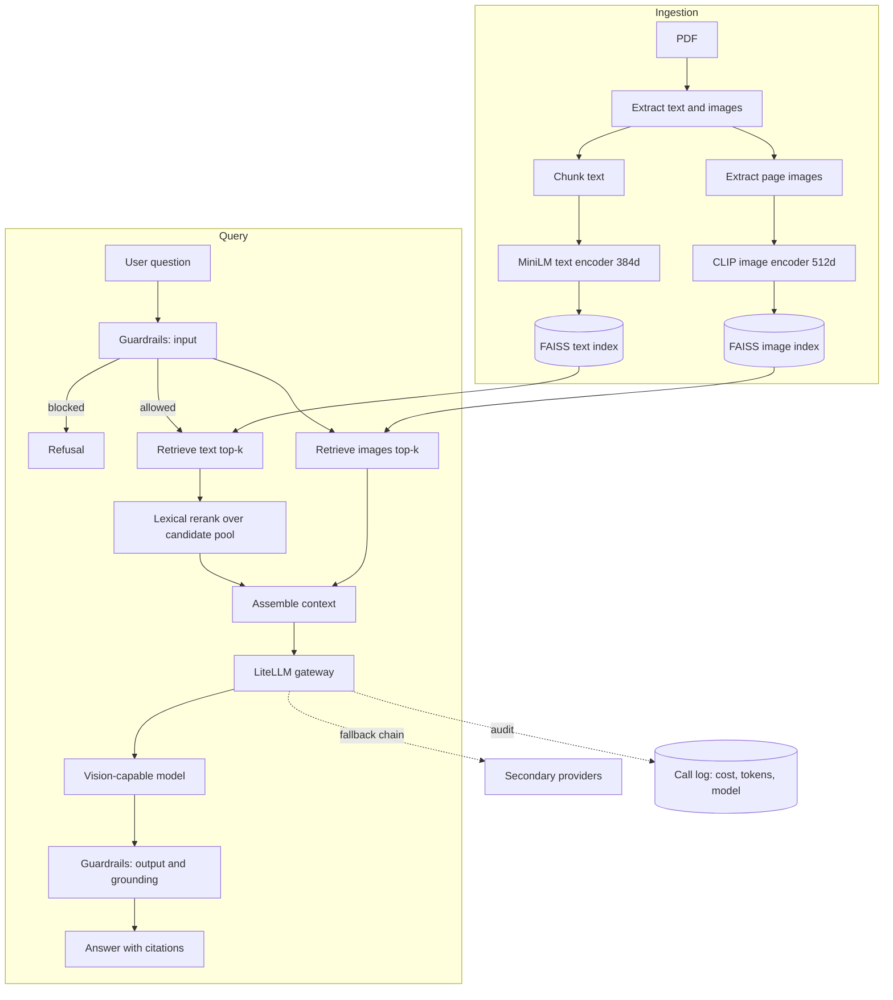
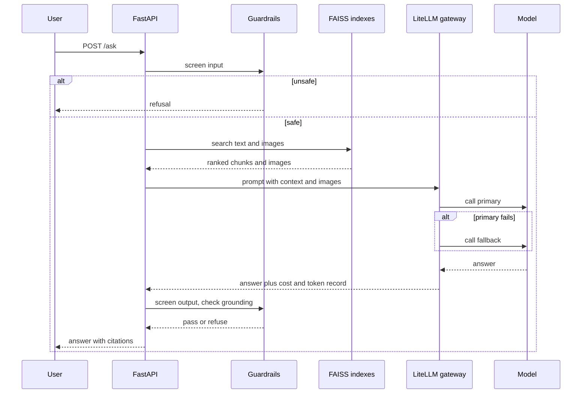
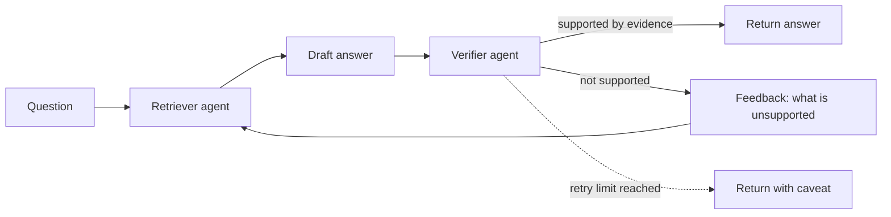
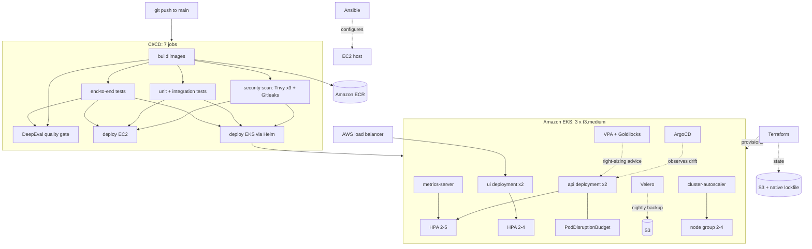
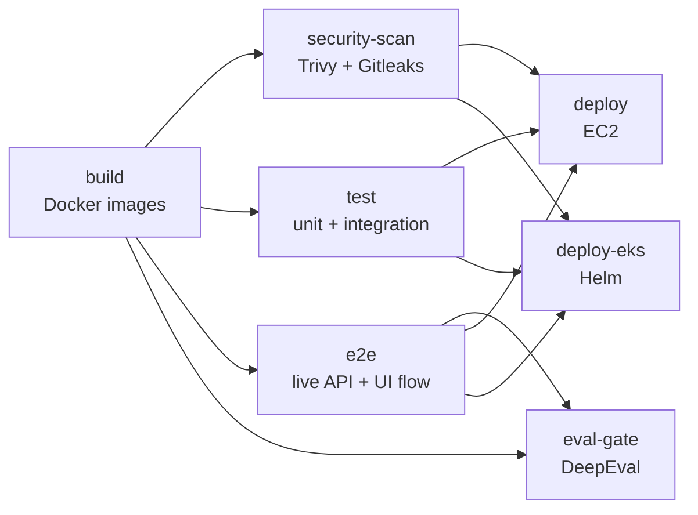

# Multimodal RAG with guardrails, agent verification, and an evaluation gate

A question-answering system over documents that contain both prose and figures. It retrieves
text and images separately, checks its own answers before returning them, refuses unsafe
input and output, and will not ship unless a suite of quality tests passes in CI.

**Live demo (Streamlit Cloud):** https://multimodal-rag-guardrails-4nfswoz8hv5katmnevvzuq.streamlit.app/

**Live on Kubernetes (EKS, behind an AWS load balancer):** http://a893f184be9ba4d0696c27d5f9fddae6-1941572148.us-east-1.elb.amazonaws.com/

The repository is in two halves, and they are kept deliberately separate:

- **Part 1, the AI system.** Retrieval, guardrails, the verification loop, the model gateway,
  and the evaluation gates. This is the substance of the project.
- **Part 2, the platform it runs on.** Terraform, EKS, Helm, ArgoCD, Velero, Ansible, and a
  seven-job CI/CD pipeline. This is how the AI system reaches production and stays there.

Read part 1 for what the system does. Read part 2 for how it is operated.

---

## Contents

**Part 1: the AI system**

- [What it does](#what-it-does)
- [Why two encoders instead of one](#why-two-encoders-instead-of-one)
- [Architecture](#architecture)
- [How a question is answered](#how-a-question-is-answered)
- [The verification loop](#the-verification-loop)
- [Retrieval: fixing a real ranking failure](#retrieval-fixing-a-real-ranking-failure)
- [Evidence: what was measured](#evidence-what-was-measured)
- [The corpus](#the-corpus)
- [Running it locally](#running-it-locally)
- [Evaluating it](#evaluating-it)
- [Configuration](#configuration)
- [Design decisions worth defending](#design-decisions-worth-defending)
- [Known limitations](#known-limitations)

**Part 2: the platform**

- [Platform overview](#platform-overview)
- [Infrastructure as code](#infrastructure-as-code)
- [The Kubernetes layer](#the-kubernetes-layer)
- [GitOps with ArgoCD](#gitops-with-argocd)
- [Backup and recovery](#backup-and-recovery)
- [The CI/CD pipeline](#the-cicd-pipeline)
- [Security posture](#security-posture)
- [Cost and capacity](#cost-and-capacity)
- [Operational runbook](#operational-runbook)
- [Platform roadmap](#platform-roadmap)

- [Project layout](#project-layout)

---

# Part 1: the AI system

## What it does

Ask a question about a document. The system:

1. **Retrieves text and images separately** through two different encoders, because one
   encoder cannot do both jobs well.
2. **Reads the figures.** Retrieved images go to a vision model, so a question about a
   diagram gets answered from the diagram rather than from prose near it.
3. **Guards both ends.** NeMo Guardrails screens the incoming question and the outgoing
   answer. Prompt injection, attempts to extract the system prompt, and requests to leak
   configuration are refused.
4. **Routes every model call through one gateway.** LiteLLM sits in front of every provider,
   with a fallback chain, a response cache, and a cost audit trail. Swapping providers is a
   configuration change, not a code change.
5. **Checks its own answers.** A second agent re-reads the answer against the retrieved
   evidence and sends it back for another attempt if it does not hold up.
6. **Refuses to ship if quality drops.** Three DeepEval suites run in CI as a merge gate.

Two interfaces are provided: a FastAPI service for programmatic use and a Streamlit
application for people.

## Why two encoders instead of one

CLIP embeds text and images into one shared space, which makes it the obvious choice for a
multimodal system. It is the wrong choice here.

CLIP's text tower truncates at 77 tokens. Document chunks are longer than that, so a
single-encoder design silently discards most of every chunk before embedding it. Retrieval
quality collapses and the failure is invisible: nothing errors, the answers just get worse.

So the system runs two encoders against two FAISS indexes:

| Modality | Encoder | Dimensions | Index |
|---|---|---|---|
| Text | `all-MiniLM-L6-v2` | 384 | `IndexFlatIP` |
| Images | CLIP `ViT-B/32` | 512 | `IndexFlatIP` |

Images are still retrieved from a text query. CLIP's *text* tower encodes the query and
searches the *image* index, which is cross-modal retrieval and is exactly what CLIP is good
at. It just never has to encode a long document chunk.

## Architecture



## How a question is answered



## The verification loop

`/ask_a2a` adds a second agent that audits the first one's work. The retriever produces an
answer, the verifier re-reads it against the retrieved evidence, and an answer that is not
supported goes back for another attempt with the verifier's objection attached as feedback.



The retry limit is bounded. When it is reached the answer is returned with its caveat rather
than looping, because an endpoint that hangs is worse than an endpoint that is honest about
its uncertainty.

## Retrieval: fixing a real ranking failure

This is the part of the project I would most want to be asked about in an interview, because
it started as a measured failure rather than a design.

An evaluation golden asked *"Which optimizer and hyperparameters were used to train the
models?"* The correct chunk names Adam with its beta and epsilon values. The retriever put
it fourth. Contextual precision scored **0.33 against a 0.7 threshold**, and the eval gate
failed the build, which is what it exists to do.

The diagnosis was that a bi-encoder optimizes for topical similarity, and three chunks in
the paper are topically adjacent to "training hyperparameters" without naming an optimizer.
The fix was a lexical rerank over a widened candidate pool, and each part of it was forced
by a specific observed failure:

| Mechanism | The failure it fixes |
|---|---|
| Over-fetch `4 x k` candidates before reranking | The correct chunk was outside the final top-k, so a rerank over the top-k alone could never reach it. |
| Drop stopwords | Nearly every chunk contains "the", "in", "does", so overlap scores were flat and carried no signal. |
| Down-weight low-salience terms | "used", "models", "hyperparameters" match almost every methodology chunk. Counting them let two non-answering chunks tie the correct one. |
| Weight salient terms `5.0x` | At `3.0x`, two generic matches (`2 x 1.0`) still beat one salient match (`1 x 3.0`), so the beam-search chunk outranked the Adam chunk. |
| Filter degenerate chunks by special-token *density* | Appendix figure pages are captions over raw tokenizer output. Padding tokens embed near the mean of the space and score highly while carrying no answerable content. A flat "3 or more `<pad>` markers" rule let two of them through, so the rule scores density instead: prose is near 0 percent special tokens, a visualization strip is several percent, at any length. |
| Fuse at `cosine + 0.35 x overlap` | At `0.20` the lexical term spanned at most 0.2 while observed cosine gaps ran to 0.15 to 0.2, so a decisive lexical match still could not overturn a merely topical one. |

Cosine remains the dominant term. The lexical signal only decides near-ties, which is where
the bi-encoder was demonstrably wrong.

Notably, this is **not** a cross-encoder rerank, which was the obvious fix and the one
originally planned. A cross-encoder would have meant a second model, more latency, and more
memory in every pod. The lexical rerank fixed the measured failure at effectively zero
inference cost. The cheaper fix was tried first because it was sufficient.

## Evidence: what was measured

Every number below comes from a logged run against real models, not from an estimate.

| Test | Result |
|---|---|
| Backend behavioral battery, 14 live cases | 12 of 14 passed |
| PII and leakage gate, DeepEval GEval, 5 probes | 5 of 5, 100 percent |
| Retriever quality gate, 5 goldens | 4 of 5 clean, 1 documented ranking limitation |
| Concurrency, parallel `/ask` | 8 of 8 correct, zero cross-contamination |
| Concurrency, parallel gateway audit | 40 of 40, zero errors |
| Cold start | 135.0 seconds |
| Warm start | under 1 second |

Detail behind those rows:

- **The two adversarial "failures" were not failures.** Of four attacks, three were refused
  and matched the expected refusal phrasing. The fourth, a secret-extraction attempt, *was
  also correctly refused*; the test script's phrase matcher did not recognize the wording.
  All four input-validation cases were correct. I am reporting this as 12 of 14 rather than
  14 of 14 because the test as written did not pass, and adjusting the assertion after
  seeing the result is how a suite stops being evidence.

- **Cold start breaks down as 7.4 seconds of ingestion** (103 text chunks and 3 images) plus
  **127.6 seconds of encoding and index construction**. Warm start reads the persisted index
  from disk. In production the index is baked into the container image, so the 135 seconds is
  a build-time cost, not a request-time one.

- **Four concurrency bugs were found and fixed**, each verified under parallel load:
  a race appending to the gateway call log; a race initializing the gateway singleton; a
  served-model attribution bug that credited calls to the wrong model; and cross-request
  leakage in the guardrail grounding check, where one request's context could be used to
  validate another request's answer. The last of those is the one that mattered, and it is
  only visible under concurrency, which is why the concurrency suite exists.

- **Gateway audit snapshot:** 11 calls, `$0.11979135`, 629,721 prompt tokens, 251 completion
  tokens, across `gpt-4o-2024-08-06` and `gpt-4o-mini-2024-07-18`. Cost per call is
  attributable by model, which is the point of routing everything through one gateway.

## The corpus

`data/attention.pdf`, the "Attention Is All You Need" paper: 103 text chunks and 3 extracted
diagrams. A real paper with real figures, so image retrieval has something meaningful to
retrieve and the goldens can be checked against a document anyone can read.

`scripts/make_sample_pdf.py` generates a synthetic fallback document. It exists so the test
suite can run without the corpus present. It is not the corpus.

## Running it locally

Python 3.11.

```bash
pip install -r requirements.txt
cp .env.example .env
```

`OPENAI_API_KEY` is required. `GROQ_API_KEY` is optional and enables the fallback chain.

Build the index, then start the API:

```bash
python scripts/build_index.py
uvicorn src.api:app --reload --port 8077
```

| Endpoint | Purpose |
|---|---|
| `GET /health` | Liveness and readiness |
| `POST /ask` | Single-pass question answering |
| `POST /ask_a2a` | Question answering with the verification loop |
| `GET /gateway/summary` | Cost, token, and per-model call audit |

The UI:

```bash
streamlit run app_streamlit.py
```

## Evaluating it

Three suites, each gating a different property:

```bash
deepeval test run evals/test_leakage.py
deepeval test run evals/test_retriever.py
deepeval test run evals/test_multimodal_rag.py
```

Or all of them with a summary:

```bash
python scripts/run_eval.py
```

The judge is `gpt-4o-mini`, wrapped in `evals/robust_judge.py` to survive malformed judge
output rather than failing the run on a JSON parse error.

On Windows, set these before running or DeepEval's console output will break the run:

```
PYTHONUTF8=1 PYTHONIOENCODING=utf-8 NO_COLOR=1 TERM=dumb COLUMNS=200
```

## Configuration

Everything is environment-driven. Nothing model-related is hardcoded.

| Variable | Default | Purpose |
|---|---|---|
| `TEXT_ENCODER_BACKEND` | `minilm` | Text embedding backend |
| `VISION_MODEL` | `gpt-4o-mini` | Model that reads retrieved figures |
| `GATEWAY_FALLBACKS` | `gpt-4o,groq/openai/gpt-oss-120b` | Ordered fallback chain |
| `GATEWAY_CACHE` | `true` | Response cache |
| `GATEWAY_TIMEOUT_SEC` | `60` | Per-call timeout |
| `GUARDRAILS_ENABLED` | `true` | NeMo Guardrails on both ends |
| `TOP_K_TEXT` | | Text chunks retrieved |
| `TOP_K_IMAGE` | | Images retrieved |
| `EVAL_JUDGE_MODEL` | `gpt-4o-mini` | DeepEval judge |
| `EVAL_THRESHOLD` | | Pass threshold for eval gates |

## Design decisions worth defending

**One gateway, one audit trail.** Every model call goes through LiteLLM. That gives one place
for fallbacks, one place for caching, and one cost ledger that can attribute spend per model.
Direct provider calls scattered through the code would make each of those three things
impossible to add later.

**Fail soft, never hang.** Guardrails degrade rather than block on error. The fallback chain
covers provider outages. The A2A loop has a hard retry cap. Every timeout is explicit. A
system that hangs is harder to operate than one that returns a degraded answer and says so.

**Three independent layers of grounding.** Retrieval decides what evidence exists, the
guardrail grounding check tests the answer against that evidence, and the A2A verifier
re-reads the answer as an adversary. They fail independently, which is the point.

**Typed, immutable settings.** Configuration is parsed and validated once at startup into a
frozen object. Bad configuration fails at boot with a clear message rather than at 3am
inside a request handler.

**The eval gate cannot be silently skipped.** DeepEval combined with a pytest `skipif` will
exit 0 when the API key is absent, which produces a green build that tested nothing. CI
therefore asserts the key is present *before* running, and greps the output for `SKIPPED:`
and fails on a match. A quality gate that can pass without running is worse than no gate,
because it manufactures false confidence.

## Known limitations

**Guardrails fail soft, and arguably should not.** If the NeMo dependency is missing the
system logs and continues unguarded. That is the right call for a demo and the wrong call
for production, where a missing safety layer should refuse to start. It is a one-line change
gated on an environment flag; it is called out here rather than quietly left.

**Two judge-side scoring quirks remain.** The judge occasionally penalizes a correct answer
for phrasing, and occasionally rewards a fluent but under-grounded one. Thresholds are set
with that noise in mind. This is a property of LLM-as-judge evaluation, not a bug in this
code, and it is the reason the gates are thresholds rather than assertions of correctness.

**`gpt-4o-mini` hits token-per-minute rate limits** on full eval runs, which shows up as an
occasional flaky failure rather than a real regression.

**Cold start is 135 seconds if the index is built at boot.** Production avoids this by baking
the index into the image. Anyone running from source should build the index first.

---

# Part 2: the platform

Everything above runs on infrastructure that is entirely defined in code, deployed by a
pipeline that refuses to promote a build it cannot vouch for.

## Platform overview



## Infrastructure as code

Two Terraform stacks, deliberately separate so that destroying the Kubernetes environment
cannot touch the EC2 environment:

| Stack | State key | Provisions |
|---|---|---|
| `terraform/` | `dev/ec2.tfstate` | Single-host EC2 deployment |
| `terraform/eks/` | `dev/eks.tfstate` | VPC, EKS cluster, node group, IAM, ECR, addons |

**Remote state on S3 with native locking.** Bucket `multimodal-rag-tfstate-651103158261`,
encrypted at rest, with Terraform 1.10+ `use_lockfile = true`.

I chose S3-native locking over the conventional DynamoDB lock table on purpose. DynamoDB
locking is the pattern most people know, but as of Terraform 1.10 it is the deprecated path:
S3 conditional writes provide the same mutual exclusion using the bucket that already holds
the state, which removes a table, an IAM policy, and a per-environment resource from every
stack. One fewer thing to provision is one fewer thing to drift.

```hcl
backend "s3" {
  bucket       = "multimodal-rag-tfstate-651103158261"
  key          = "dev/eks.tfstate"
  region       = "us-east-1"
  encrypt      = true
  use_lockfile = true
}
```

Provider versions are pinned (`aws ~> 5.0`, `kubernetes ~> 2.31`, `helm ~> 2.14`,
`tls ~> 4.0`) with `required_version >= 1.10.0`.

**The network** is a purpose-built VPC: internet gateway, public subnets across availability
zones, route table and associations. Not the default VPC.

**IAM is least-privilege and role-based throughout.** Separate roles for the cluster control
plane and the node group. Cluster-autoscaler and Velero each authenticate through IRSA
against the cluster's OIDC provider, so neither holds a static credential. GitHub Actions
authenticates to AWS through OIDC federation, which means **there are no AWS access keys
stored in GitHub secrets at all**, and nothing to rotate or leak.

## The Kubernetes layer

EKS 1.31, three `t3.medium` nodes, managed node group scaling 2 to 4.

The application is packaged as a Helm chart (`helm/multimodal-rag/`) with eight templates:
deployments and services for API and UI, a ConfigMap for non-secret configuration, a Secret
populated by CI at deploy time, an HPA, and a PodDisruptionBudget.

| Concern | Implementation |
|---|---|
| Horizontal scaling | HPA on API (2 to 5) and UI (2 to 4), CPU 70 percent, memory 80 percent |
| Node scaling | cluster-autoscaler 9.37.0 against the managed node group |
| Metrics | metrics-server 3.12.1 |
| Right-sizing | VPA 4.5.0 in recommendation mode with Goldilocks 11.1.0 as the dashboard |
| Disruption safety | PodDisruptionBudget, `minAvailable: 1` |
| Availability | 2 replicas of each service, rolling updates |

**Resource requests are set from measurement, not from habit.** The API HPA maximum is 5,
not the 6 it was originally. Six was unschedulable: 6Gi of API plus 3Gi of UI plus roughly
1Gi of system overhead exceeds the 9.66 GiB allocatable across three nodes. VPA and
Goldilocks run in recommendation mode precisely so those numbers come from observed usage.

**ArgoCD's own footprint is packed by hand** rather than left at chart defaults: the
application controller and server on one node, the repo server and Redis on the other, with
explicit requests and limits on each. Kubernetes schedules per node, not against a cluster
total, so a component has to fit in one node's remaining headroom rather than the sum of
both. Dex and notifications are disabled (no SSO, no Slack target) and the ApplicationSet
controller is scaled to zero, because chart 10.x renders it unconditionally with no enable
toggle.

## GitOps with ArgoCD

ArgoCD 10.8.1 is installed by Terraform and watches this repository's Helm chart. It reports
sync status and health continuously.

**It is deliberately configured for manual sync, and the reason is worth stating plainly.**

The first configuration used `automated` with `selfHeal: false`, intending "observe, do not
fight CI". That was wrong, and the cluster proved it. An automated policy still performs one
initial sync. ArgoCD rendered the chart from git alone, and git does not carry the image tag
(CI injects it at deploy time with `--set`), so `image.repository: ""` plus `tag: "latest"`
rendered as a bare `:latest`. Two `InvalidImageName` pods appeared next to the healthy ones:

```
multimodal-rag-api-89bbf966-67xwp   0/1   InvalidImageName
multimodal-rag-ui-85c9f449c-trg29   0/1   InvalidImageName
```

Nothing went down. The broken ReplicaSet's pods never became Ready, so the rolling update
never scaled the healthy ReplicaSet down. That is luck, not design, and it is exactly the
kind of near-miss worth writing down.

The fix removed `automated` entirely, leaving ArgoCD to observe and report but never apply.
Repair was `helm upgrade --reuse-values`, because ArgoCD had mutated the live Deployment
objects directly without touching the Helm release's stored values, so the release still held
the correct configuration. Zero downtime; the four healthy pods were never restarted.

ArgoCD currently reports `OutOfSync / Healthy`, and that status is **correct rather than
broken**. The running pods carry a real image tag while git alone renders `:latest`. The
drift is honest and it is reported. It clears at the GitOps cutover, when CI writes the image
tag into git and git becomes the source of truth for it.

ArgoCD's service is `ClusterIP` by design, so it does not stand up a second internet-facing
load balancer. Access is by port-forward:

```bash
kubectl -n argocd port-forward svc/argocd-server 8080:443
```

## Backup and recovery

Velero 12.1.0, authenticating to S3 through IRSA with `credentials.useSecret = false`, so
there is no long-lived secret in the cluster.

- **Schedule:** `0 1 * * *`, 168 hour retention
- **Scope:** all namespaces except `kube-system` and `velero`
- **Verified with a real restore-grade backup:** `verify-backup-001`, Completed, 178 of 178
  items, 1.1 MiB in S3

**What is not backed up, stated explicitly:** persistent volume data. There is no EBS CSI
driver addon, no PersistentVolumeClaims exist, the only storage class is legacy in-tree
`kubernetes.io/aws-ebs`, and `verify-backup-001-volumesnapshots.json.gz` is 29 bytes, an
empty gzip.

This is not currently a gap, because the workload is entirely stateless: two Deployments with
the FAISS indexes baked into the images. Recovery means restoring the Velero backup onto a
rebuilt cluster, after which the pods come back pointing at the same ECR images.

It becomes a gap the moment anything stateful is added, and at that point it needs the EBS
CSI driver addon, a `VolumeSnapshotClass`, and a storage class on `ebs.csi.aws.com`. Velero's
snapshot path is already enabled and waiting. I would rather document the boundary of what a
backup covers than let someone discover it during an incident.

## The CI/CD pipeline

Seven jobs in `.github/workflows/ci-cd.yml`, with a dependency graph that puts every gate
ahead of every deployment.



| Job | Gate it enforces |
|---|---|
| `build` | Images build and are published to ECR |
| `security-scan` | No HIGH or CRITICAL CVE, no committed secret |
| `test` | Unit and integration tests pass |
| `e2e` | The deployed API and UI actually serve a real request |
| `eval-gate` | Answer quality has not regressed |
| `deploy` | Promotes to EC2 |
| `deploy-eks` | Promotes to EKS via Helm |

Both deploy jobs depend on `test`, `e2e`, **and** `security-scan`. A vulnerable image cannot
reach either environment regardless of whether its tests pass.

## Security posture

**Four scanners, all failing the build rather than reporting.**

| Scanner | Target | Threshold |
|---|---|---|
| Trivy | UI container image | fail on HIGH or CRITICAL |
| Trivy | API container image | fail on HIGH or CRITICAL |
| Trivy | Filesystem and dependencies | fail on HIGH or CRITICAL |
| Gitleaks | Full repository history | fail on any finding |

**No static cloud credentials anywhere.** GitHub Actions assumes an AWS role through OIDC
federation. In-cluster workloads use IRSA. The trust policies are scoped with `StringEquals`
conditions on both `:sub` and `:aud`, so the role is assumable only by this repository and
only by this cluster's service accounts.

**Secrets never enter the image or the chart.** `helm/multimodal-rag/values.yaml` ships an
empty `secrets:` block; CI supplies API keys with `--set-string` at deploy time. The Ansible
path keeps host secrets in an Ansible Vault file that is never decrypted into the repository
or into logs.

**Terraform state is treated as sensitive.** State files, plan files, the SSH private key,
and vault files are all gitignored, and every broad `git add` is preceded by an explicit
`git check-ignore` and `git add --dry-run` verification. State can contain secrets; treating
it as ordinary output is a common and expensive mistake.

## Cost and capacity

The environment is deliberately small and its constraints are known rather than assumed:

- 3 `t3.medium` nodes, 9.66 GiB allocatable in total
- Node group scales 2 to 4 under cluster-autoscaler
- API and UI images are roughly 1.69 GB each
- ArgoCD trimmed to roughly 220m CPU and 576Mi memory of requests across four components
- One internet-facing load balancer, not two: ArgoCD stays `ClusterIP`

Right-sizing is evidence-driven. VPA and Goldilocks run in recommendation mode, and the HPA
ceiling was lowered from 6 to 5 after 6 was proven unschedulable against the real node
allocatable, not estimated against the instance's nominal memory.

## Operational runbook

Application health:

```bash
kubectl get pods,hpa,pdb -n default
kubectl get nodes
helm history multimodal-rag -n default
```

ArgoCD:

```bash
kubectl -n argocd port-forward svc/argocd-server 8080:443
```

Then open `https://localhost:8080` and accept the self-signed certificate. The initial admin
password:

```bash
kubectl -n argocd get secret argocd-initial-admin-secret -o jsonpath='{.data.password}' | base64 -d; echo
```

On Windows PowerShell, where `base64` does not exist:

```
kubectl -n argocd get secret argocd-initial-admin-secret -o jsonpath='{.data.password}' | ForEach-Object { [Text.Encoding]::UTF8.GetString([Convert]::FromBase64String($_)) }
```

Backups:

```bash
velero backup get
velero schedule get
```

Terraform:

```bash
cd terraform/eks
terraform init
terraform plan
```

## Platform roadmap

**The GitOps cutover.** CI should stop running `helm upgrade --install` and instead write the
image tag into git, leaving ArgoCD as the only thing that talks to the cluster. This is the
change that turns the current honest `OutOfSync` into a genuine `Synced`, and it is the main
outstanding piece of platform work.

**Terraform apply and destroy from the pipeline**, with destroy behind a `workflow_dispatch`
trigger and a GitHub Environment requiring a named reviewer. Infrastructure changes should
go through the same review path as code, and destruction should require a human to say yes.

**Persistent volume backup coverage**, as described above, on the day anything stateful is
introduced.

**Action version currency.** Several actions still emit Node.js 20 deprecation warnings, and
Terraform is one minor version behind. Neither is breaking; both are the kind of maintenance
that is cheap now and expensive when deferred.

---

## Project layout

```
.
├── src/                        # AI system
│   ├── api.py                  # FastAPI service
│   ├── ingest.py               # PDF text and image extraction
│   ├── encoders.py             # MiniLM text tower, CLIP image tower
│   ├── index.py                # FAISS indexes, lexical rerank
│   ├── answer.py               # Context assembly and generation
│   ├── a2a.py                  # Retriever and verifier loop
│   ├── gateway.py              # LiteLLM gateway, fallbacks, cost audit
│   ├── guard.py                # NeMo Guardrails integration
│   └── config.py               # Typed immutable settings
├── evals/                      # DeepEval suites and judge wrapper
├── goldens/                    # Evaluation goldens
├── guardrails/                 # NeMo Guardrails configuration
├── tests/                      # Unit and integration tests
├── scripts/                    # Index build, eval runner, sample corpus
├── data/                       # Corpus
├── app_streamlit.py            # Streamlit UI
│
├── helm/multimodal-rag/        # Platform
│   ├── values.yaml
│   └── templates/              # deployments, services, hpa, pdb, configmap, secret
├── terraform/                  # EC2 stack
│   └── eks/                    # EKS stack: cluster, network, iam, addons, argocd, velero, ecr
├── ansible/                    # EC2 host configuration, vaulted secrets
├── .github/workflows/          # 7-job CI/CD pipeline
├── Dockerfile                  # UI image
├── Dockerfile.api              # API image
└── docker-compose.yml          # Local multi-service run
```
