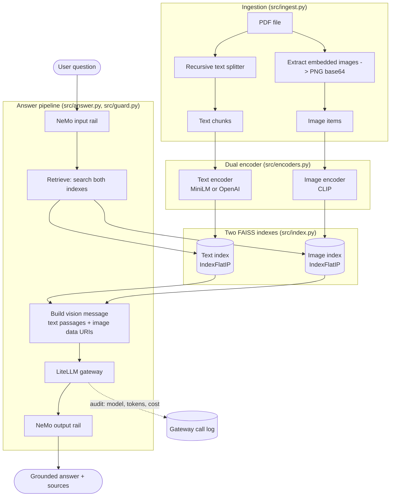
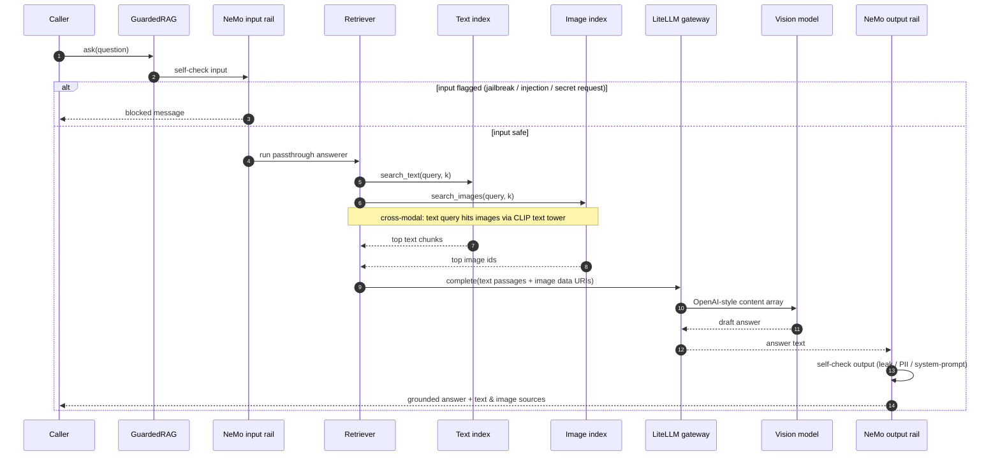
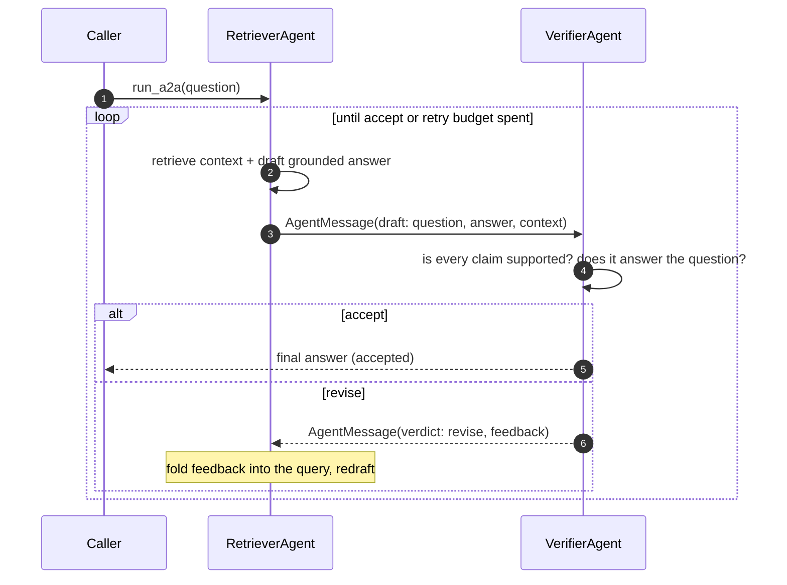

# Multimodal RAG: dual-encoder retrieval, guardrails, A2A, gateway, eval gate

A retrieval-augmented question-answering service over PDFs that carry both text
and figures. You ask a question about a document, the system retrieves the
relevant passages **and** the relevant images, shows both to a vision model, and
returns a grounded answer with its sources attached. Every answer runs behind
safety rails, and an offline evaluation gate scores answer quality against a
golden set before anything ships.

It closes a set of gaps that a CLIP-only notebook leaves open: separate encoders
per modality, explicit guardrails, a single audited model gateway, an
agent-to-agent verification loop, and a measurable eval gate.

> **Scope.** This repository is the RAG application and its evaluation. DevOps
> (ArgoCD, Ansible, Kubernetes) is intentionally out of scope here.

## Contents

- [What it does](#what-it-does)
- [Why a dual encoder](#why-a-dual-encoder)
- [Architecture](#architecture)
- [How a question is answered](#how-a-question-is-answered)
- [The A2A verification loop](#the-a2a-verification-loop)
- [The sample data is synthetic](#the-sample-data-is-synthetic)
- [Project layout](#project-layout)
- [Setup](#setup)
- [Run it](#run-it)
- [Evaluate](#evaluate)
- [Configuration](#configuration)
- [Design notes](#design-notes)

## What it does

- **Dual-encoder retrieval.** Text is embedded by a dedicated text encoder
  (local MiniLM by default, or OpenAI `text-embedding-3-small`); images are
  embedded by CLIP. They live in two separate FAISS indexes. A query hits both.
- **Reads figures, not just captions.** PDF ingestion extracts embedded raster
  images (charts, diagrams) alongside text. Retrieved images are passed to the
  vision model as data URIs, so the answer can rely on what a figure shows.
- **NeMo Guardrails.** Every answer runs behind input and output rails
  (jailbreak, injection, and secret-leak checks) before it reaches the caller.
- **LiteLLM gateway.** One `complete()` call fronts the answering model, with
  transparent fallbacks, a local cache, and a per-call audit log of model,
  tokens, and cost.
- **A2A loop.** A retriever agent drafts an answer and a verifier agent returns
  a JSON accept-or-revise verdict, exchanged over a bounded message loop.
- **DeepEval offline gate.** A pytest suite scores answers over a golden set
  with answer-relevancy, GEval correctness, and faithfulness metrics. The judge
  model is `gpt-4o-mini`; the suite skips cleanly when no key is present.
- **Two surfaces.** A FastAPI service and a Streamlit UI. The Streamlit app also
  lets you upload your own PDF and query it in place.

## Why a dual encoder

CLIP has a text tower, so it is tempting to embed everything with CLIP and keep
one index. That tower caps input at 77 tokens and silently truncates anything
longer, which throws away most of a document passage. So this project splits the
job by modality:

- **Text** goes through a proper text encoder (MiniLM or OpenAI), which handles
  full passages.
- **Images** go through CLIP.
- CLIP's text tower is used **only** on short query strings, to retrieve images
  cross-modally (a text query finding a relevant figure).

The two encoders produce vectors in different spaces, so they need two indexes.
That is the reason for the split, not an accident of it.

## Architecture



The same retrieval and gateway core is reused by three callers: the guarded RAG
path, the A2A loop, and the eval gate. Nothing re-implements retrieval.

## How a question is answered

The guarded path is the default. The input rail runs first, then retrieval and
the vision call, then the output rail. If either rail blocks, the model is never
shown the content on that side.



The system prompt tells the model to answer only from the supplied context, to
say when the context is insufficient, and not to invent numeric values a chart
only describes in relative terms. That instruction is the first line of defence
against hallucination; the NeMo output rail and the DeepEval faithfulness metric
are the second and third.

## The A2A verification loop

The A2A path swaps the output rail for a second agent. A retriever agent drafts
a grounded answer; a verifier agent checks every claim against the same context
and either accepts it or hands back concrete feedback to redraft. The exchange
is bounded by a retry budget, and each turn is a plain dataclass message, so the
whole conversation is inspectable.



A malformed verdict is treated as accept, so a judge hiccup never blocks a usable
answer; the reason field records that the parse failed. This is a deliberately
small, honest A2A: two cooperating roles over a shared message type, not a
network protocol or a multi-process broker.

## The sample data is synthetic

`scripts/make_sample_pdf.py` generates `data/sample_report.pdf`, and its numbers
(for example an accuracy of 0.86 and a three-bar chart) are illustrative, not
measurements from a real system. The golden answers in
`goldens/multimodal_goldens.json` (4 hand-written cases) match that synthetic
document. Swap in your own PDFs to evaluate real content.

## Project layout

```
src/
  config.py     central Settings snapshot (paths, models, thresholds)
  encoders.py   TextEncoder (minilm/openai) + ImageEncoder (CLIP)
  ingest.py     PDF -> text chunks + extracted images (base64)
  index.py      two FAISS indexes, cross-modal search, save/load
  gateway.py    LiteLLM gateway with fallbacks, cache, audit log
  answer.py     retrieve -> build vision message -> grounded answer
  guard.py      NeMo input/output rails around the pipeline
  a2a.py        retriever + verifier agents over a message loop
  api.py        FastAPI service
guardrails/config/   NeMo config.yml + prompts.yml
goldens/             synthetic golden set for the eval gate
evals/               DeepEval pytest gate + robust judge
scripts/             make_sample_pdf, build_index, run_eval
app_streamlit.py     Streamlit UI (also supports uploading your own PDF)
```

## Setup

Python 3.11. From this folder:

```bash
pip install -r requirements.txt
cp .env.example .env   # then fill in OPENAI_API_KEY
```

The text side runs locally with MiniLM and needs no key. A key is required for
answering (the vision model), guardrails, the A2A verifier, and the eval judge.
An optional `GROQ_API_KEY` enables the gateway fallback chain.

## Run it

Build the index first (MiniLM and CLIP download on first run):

```bash
python scripts/make_sample_pdf.py
python scripts/build_index.py
```

FastAPI:

```bash
uvicorn src.api:app --host 0.0.0.0 --port 8000
```

| Method | Route              | Purpose                                        |
|--------|--------------------|------------------------------------------------|
| GET    | `/health`          | Liveness, plus whether an index and keys exist |
| POST   | `/ask`             | Guarded RAG answer with sources                |
| POST   | `/ask_a2a`         | Retriever/verifier agent-to-agent answer       |
| GET    | `/gateway/summary` | Cost, token, and model audit from the gateway  |

```bash
curl -s localhost:8000/ask -H 'content-type: application/json' \
  -d '{"question": "What is the model architecture in the document?"}'
```

Streamlit:

```bash
streamlit run app_streamlit.py
```

The Streamlit app serves the synthetic sample out of the box and lets you upload
your own PDF from the sidebar; it re-indexes the upload and answers from it,
showing the retrieved text passages and the actual retrieved figures.

## Evaluate

```bash
python scripts/run_eval.py
# equivalently:
deepeval test run evals/test_multimodal_rag.py
```

The gate scores each golden answer on answer-relevancy, GEval correctness, and
faithfulness. The judge is `gpt-4o-mini` and needs `OPENAI_API_KEY`. A rare
golden whose structured verdict makes the primary judge hit its output-token
ceiling falls back to a larger-output judge over Groq (`evals/robust_judge.py`);
no new provider is introduced, since Groq is already the gateway fallback.

LLM-judged scores are probabilistic evidence with reasons attached, not proof of
correctness. Without a key the suite skips every case rather than failing.

## Configuration

Everything is driven by environment variables read in `src/config.py`; see
`.env.example` for the full list. No secret is hardcoded: the OpenAI and Groq
keys are read from the environment only. Notable switches:

| Variable                 | Default                          | Effect                                   |
|--------------------------|----------------------------------|------------------------------------------|
| `TEXT_ENCODER_BACKEND`   | `minilm`                         | `minilm` (local, no key) or `openai`     |
| `VISION_MODEL`           | `gpt-4o-mini`                    | Answering model, called via the gateway  |
| `GATEWAY_FALLBACKS`      | `gpt-4o,groq/llama-3.3-70b-...`  | Ordered fallback chain if the primary fails |
| `GATEWAY_CACHE`          | `true`                           | Local LiteLLM response cache             |
| `GUARDRAILS_ENABLED`     | `true`                           | Turn the NeMo rails on or off            |
| `TOP_K_TEXT` / `TOP_K_IMAGE` | `4` / `3`                    | Retrieval depth per modality             |
| `EVAL_JUDGE_MODEL`       | `gpt-4o-mini`                    | DeepEval judge model                     |
| `EVAL_THRESHOLD`         | `0.7`                            | Pass threshold for the eval metrics      |

## Design notes

- **One gateway, one audit trail.** Every model call in the project, whether it
  is the vision answer, the A2A verifier, or a guardrails check, goes through
  `src/gateway.py`. Provider choice, fallbacks, caching, and cost tracking live
  in one place, and the call log gives a per-call record of model, tokens,
  latency, and USD cost.
- **Fail soft, never hang.** The gateway has a per-call wall-clock cap; a stalled
  provider fails at that point and the fallback chain takes over, so no single
  call can hang the app. Undecodable images are skipped during ingestion rather
  than crashing a run.
- **Grounding in three layers.** The answer prompt restricts the model to the
  retrieved context, the NeMo output rail blocks leaks, and the DeepEval
  faithfulness metric measures grounding offline. No single layer is trusted to
  be perfect.
- **Immutable settings.** `Settings` is a frozen dataclass built once at import,
  so the rest of the code reads settings and never re-parses environment
  literals.
