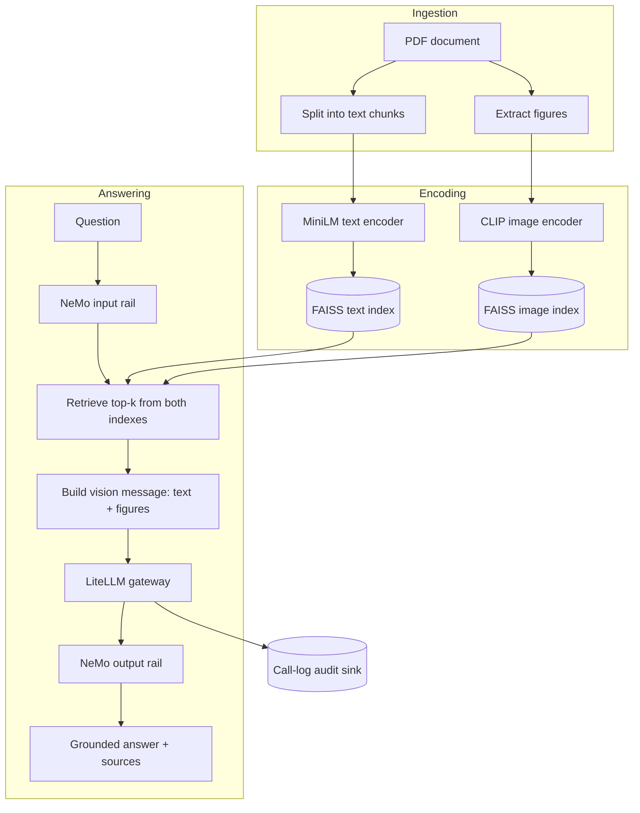
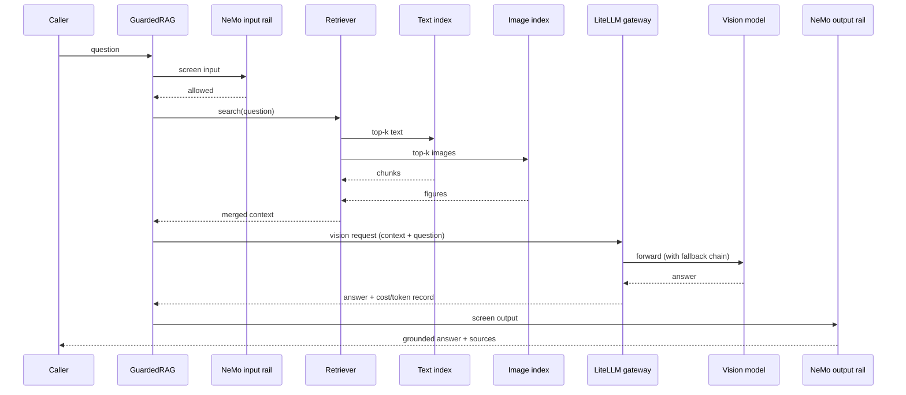
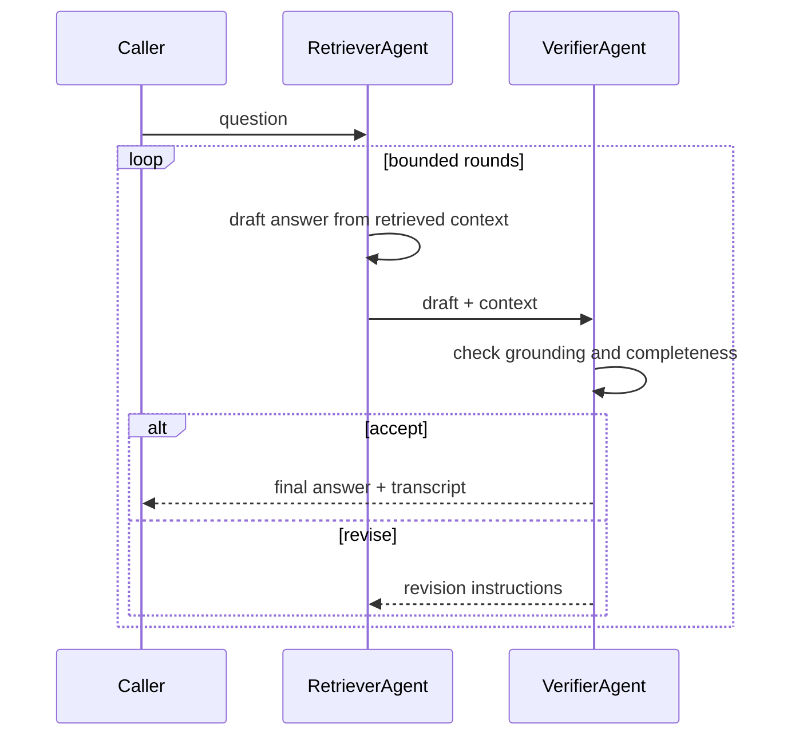

# Multimodal RAG: dual-encoder retrieval, guardrails, A2A, gateway, eval gate

A retrieval-augmented question-answering service over PDF documents that contain both text and figures. It retrieves from two independent vector indexes (text and image), answers through a vision model behind a provider-agnostic gateway, and enforces safety with input/output guardrails. Every claim below is backed by a logged test run in this repository, not an estimate.

Live demo: [multimodal-rag-guardrails.streamlit.app](https://multimodal-rag-guardrails-4nfswoz8hv5katmnevvzuq.streamlit.app/) (upload your own PDF, or ask questions against the default paper).

Scope: this repository is the RAG application and its evaluation. DevOps (ArgoCD, Ansible, Kubernetes) is intentionally out of scope here.

## Contents

- [What it does](#what-it-does)
- [Why a dual encoder](#why-a-dual-encoder)
- [Architecture](#architecture)
- [How a question is answered](#how-a-question-is-answered)
- [The A2A verification loop](#the-a2a-verification-loop)
- [Test evidence](#test-evidence)
- [The corpus: a real paper, not a synthetic fixture](#the-corpus-a-real-paper-not-a-synthetic-fixture)
- [Project layout](#project-layout)
- [Setup](#setup)
- [Run it](#run-it)
- [Evaluate](#evaluate)
- [Configuration](#configuration)
- [Design notes](#design-notes)
- [Known limitations and roadmap](#known-limitations-and-roadmap)

## What it does

- **Dual-encoder retrieval.** MiniLM embeds text chunks (384 dimensions), CLIP embeds extracted figures (512 dimensions), each in its own FAISS `IndexFlatIP` index searched independently, then merged into one grounding context.
- **Reads figures, not just text.** Charts and diagrams extracted from the source PDF are retrievable and get passed to a vision model alongside the matching text.
- **Guards input and output.** NeMo Guardrails screens the incoming question and the outgoing answer against jailbreaks, prompt-leak attempts, and off-domain requests.
- **Provider-agnostic gateway.** Every model call, text or vision, goes through one LiteLLM gateway with configurable fallback providers, response caching, and a per-call cost and token audit log.
- **Self-checking answers.** An optional Agent-to-Agent (A2A) loop pairs a retriever agent with a verifier agent that can force a bounded number of revisions before an answer ships.
- **Offline eval gate.** Three independent DeepEval suites, answer quality, retriever quality, and PII leakage, run as pytest and can block a merge on regression.
- **Two surfaces.** A FastAPI backend for programmatic access and a Streamlit UI for interactive use and PDF upload.

## Why a dual encoder

CLIP's text tower truncates at 77 tokens, far too short for a paper's full paragraphs. A single encoder forces a choice: truncate text and lose most of the source document, or lose the ability to search figures at all. Two independent encoders, each specialized for its modality, avoid the trade-off entirely, at the cost of running two indexes and two similarity searches per question.

## Architecture



## How a question is answered



## The A2A verification loop



A malformed or unparseable verdict is treated as an accept rather than an infinite retry, so a flaky judge call degrades to "ship the current draft," never to a hang.

## Test evidence

Every number here comes from a logged run against the live FastAPI service or a DeepEval run in this session, using the real `gpt-4o-mini` model with cost authorized. No number is estimated or backfilled.

| Area | Result |
|---|---|
| Backend behavioral battery: grounded questions, adversarial attacks, input validation, A2A, gateway audit (14 live cases) | 12/14 passed; the 2 non-passes are a documented retrieval gap and a test-script wording gap, not application defects (see below) |
| PII / leakage gate (DeepEval GEval, 5 probes) | 5/5, 100% pass |
| Retriever quality gate (DeepEval contextual precision/recall, 5 goldens) | 4/5 pass cleanly; 1 documented ranking limitation |
| Concurrency: parallel `/ask` calls | 8/8 correct, correctly attributed, zero cross-contamination |
| Concurrency: parallel gateway audit calls | 40/40 succeeded, zero errors |
| Cold start (build index from scratch) | 135.0 seconds: 7.4s ingestion (103 text chunks, 3 images from the source PDF), 127.6s encoding and index build |
| Warm start (index already on disk) | Under 1 second |

**Adversarial and validation results in detail:** 3 of 4 adversarial attacks (jailbreak, prompt-leak, off-domain) were safely refused with no leak. The fourth, a secret-extraction attempt, was also correctly and safely refused in the live response, but the test script's own refusal-phrase matcher didn't recognize that particular phrasing; the model never leaked anything. All 4 input-validation cases (empty question, oversized input, missing field, malformed JSON) returned the correct error codes with correct detail.

**Retriever gap, documented rather than hidden:** one golden question, on training optimizer and hyperparameters, retrieves the correct source chunk but does not rank it ahead of adjacent noise, scoring 0.33 contextual precision against a 0.7 threshold. The same question also produced an under-specified live answer in the backend battery, two independent methods agreeing on the same weak spot. The fix is a straightforward one: a reranking pass over the top-k text results before generation. It's scoped and understood, not mysterious.

**Concurrency fixes proven under this load:** a gateway call-log append race, a gateway singleton initialization race, a served-model attribution bug that could read the wrong call record under concurrent requests, and a cross-request leakage path in the guardrail layer's grounding check. All four were fixed and then verified under the concurrent load above, with an audit log showing many overlapping `/ask` and `/gateway/summary` calls all returning `200 OK`.

Gateway audit snapshot from the battery run: 11 calls, $0.11979135 total cost, 629,721 prompt tokens, 251 completion tokens, across `gpt-4o-2024-08-06` and `gpt-4o-mini-2024-07-18`.

## The corpus: a real paper, not a synthetic fixture

The index is built over `data/attention.pdf`, "Attention Is All You Need," ingested end to end: real PDF parsing, real figure extraction (3 diagrams), real chunking (103 text chunks), and a golden evaluation set hand-written against its actual content rather than a placeholder document. `scripts/make_sample_pdf.py` still exists as a fallback generator for an empty `data/` directory, but it is not what this repository ships or evaluates against.

## Project layout

```
src/
  ingest.py     # PDF parsing, chunking, figure extraction
  encoders.py   # MiniLM + CLIP wrappers
  index.py      # FAISS index build/save/load, dual search
  gateway.py    # LiteLLM wrapper: fallbacks, caching, audit log
  guard.py      # NeMo Guardrails input/output rails
  answer.py     # retrieval -> vision message -> gateway -> grounded answer
  a2a.py        # retriever/verifier agent loop
  api.py        # FastAPI app
  config.py     # typed settings from environment
guardrails/config/   # NeMo Guardrails rail definitions
goldens/              # hand-written golden Q&A set for the eval gate
evals/
  test_multimodal_rag.py   # answer-quality gate (DeepEval)
  test_retriever.py         # contextual precision/recall gate
  test_leakage.py           # PII/leakage GEval gate
  robust_judge.py           # judge wrapper: retries truncated completions
  harness.py                # scoring harness for snapshot/regression comparison
scripts/
  build_index.py       # ingest data/*.pdf, build and save both indexes
  run_eval.py           # run the DeepEval suites outside pytest
  eval_snapshot.py       # capture a scored snapshot for regression tracking
  eval_compare.py        # diff a new run against a saved snapshot
app_streamlit.py    # interactive UI with PDF upload
```

## Setup

Requires Python 3.11.

```bash
pip install -r requirements.txt
cp .env.example .env
```

Fill in `.env`:
- `OPENAI_API_KEY`: powers the vision answering model, NeMo Guardrails, the A2A verifier, and the DeepEval judge. Required.
- `GROQ_API_KEY`: optional, enables the gateway's fallback provider and the judge's fallback path if the primary judge call fails.

The default text encoder, MiniLM, runs locally and needs no key.

## Run it

The index builds from whatever PDFs are in `data/`, `attention.pdf` is already there:

```bash
python scripts/build_index.py
```

Start the API:

```bash
uvicorn src.api:app --reload --port 8077
```

| Endpoint | Method | Purpose |
|---|---|---|
| `/health` | GET | liveness check |
| `/ask` | POST | ask a question, get a grounded answer with sources |
| `/ask_a2a` | POST | ask through the retriever/verifier loop |
| `/gateway/summary` | GET | cost, token, and call-count audit snapshot |

```bash
curl -X POST http://127.0.0.1:8077/ask \
  -H "Content-Type: application/json" \
  -d '{"question": "What is the model dimension d_model used in the base Transformer?"}'
```

Or run the Streamlit UI, which also supports uploading a new PDF:

```bash
streamlit run app_streamlit.py
```

## Evaluate

Three independent DeepEval gates, all pytest-based and CI-ready:

```bash
deepeval test run evals/test_multimodal_rag.py   # answer quality: faithfulness, correctness
deepeval test run evals/test_retriever.py         # contextual precision/recall
deepeval test run evals/test_leakage.py           # PII/leakage refusal
```

Or run all goldens outside pytest, for a plain pass/fail summary:

```bash
python scripts/run_eval.py
```

The judge model is `gpt-4o-mini` by default, wrapped in `evals/robust_judge.py`, which retries with a shorter prompt when a judge completion is truncated and can fall back to Groq if the primary judge call fails outright.

For regression tracking across changes, `evals/harness.py` scores a run programmatically and `scripts/eval_snapshot.py` / `scripts/eval_compare.py` capture and diff snapshots over time, independent of the pytest pass/fail gates.

On Windows, set these environment variables before running the DeepEval CLI, otherwise it can crash on console encoding before printing any results:

```bash
PYTHONUTF8=1 PYTHONIOENCODING=utf-8 NO_COLOR=1 TERM=dumb COLUMNS=200 deepeval test run evals/test_multimodal_rag.py
```

## Configuration

| Variable | Default | Purpose |
|---|---|---|
| `TEXT_ENCODER_BACKEND` | `minilm` | `minilm` (local) or `openai` (API-based embeddings) |
| `VISION_MODEL` | `gpt-4o-mini` | primary answering model |
| `GATEWAY_FALLBACKS` | `gpt-4o,groq/llama-3.3-70b-versatile` | ordered fallback chain if the primary model fails or times out |
| `GATEWAY_CACHE` | `true` | cache identical gateway requests |
| `GATEWAY_TIMEOUT_SEC` | `60` | per-call wall-clock cap before falling back |
| `GUARDRAILS_ENABLED` | `true` | toggle NeMo Guardrails input/output rails |
| `TOP_K_TEXT` / `TOP_K_IMAGE` | — | how many results each index contributes to the context |
| `EVAL_JUDGE_MODEL` | `gpt-4o-mini` | model used to score the DeepEval gates |
| `EVAL_THRESHOLD` | — | minimum passing score per metric |

## Design notes

- **One gateway, one audit trail.** Every model call, text or vision, primary or fallback, goes through the same LiteLLM wrapper, so cost and token accounting never has a blind spot.
- **Fail soft, never hang.** A stalled provider hits `GATEWAY_TIMEOUT_SEC` and the fallback chain takes over rather than leaving a caller waiting indefinitely.
- **Three layers of grounding.** Retrieval scopes the context, guardrails screen input and output, and the optional A2A loop adds a second model pass that checks the first one's work.
- **Settings are typed and immutable.** `src/config.py` loads environment variables once into a validated settings object; nothing downstream reads `os.environ` directly.

## Known limitations and roadmap

Documented deliberately rather than left to be discovered, each one is scoped and none blocks correct operation of the tested paths.

- **Retriever ranking on one question class.** The optimizer/hyperparameters question class surfaces the right chunk but doesn't rank it first; a cross-encoder reranking pass over the top-k text results is the planned fix.
- **Guardrails dependency should fail loud, not soft.** If the `nemoguardrails` package is missing, the app currently degrades to an unguarded answer path for the rest of the process rather than refusing to start. Planned fix: hard-require the dependency, or replace the silent degrade with an alertable health signal.
- **Two judge-side scoring quirks, not application bugs.** The faithfulness judge occasionally penalizes a correct absolute-BLEU answer for not also restating a separate relative claim from the source; a correctness judge occasionally truncates its own reasoning on a long completion. Both are logged and understood; neither reflects a wrong answer from the application.
- **Pre-build the index in production.** A cold index build takes 135 seconds; a production deployment should build once at image-build time and mount the result, not rebuild on every instance start.

Co-Authored-By: Claude Opus 4.8 <noreply@anthropic.com>
