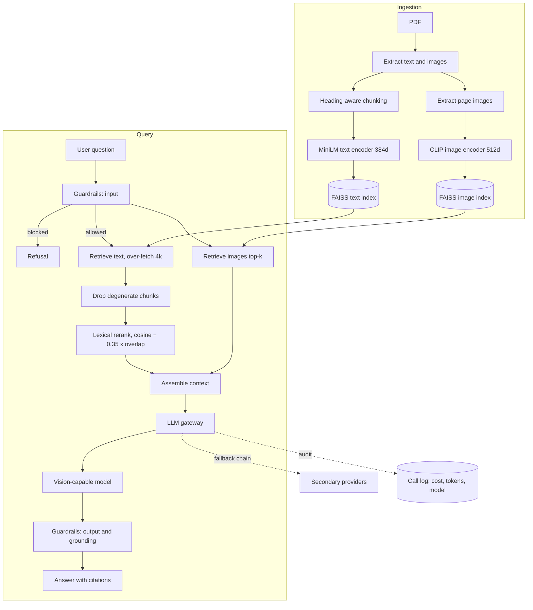
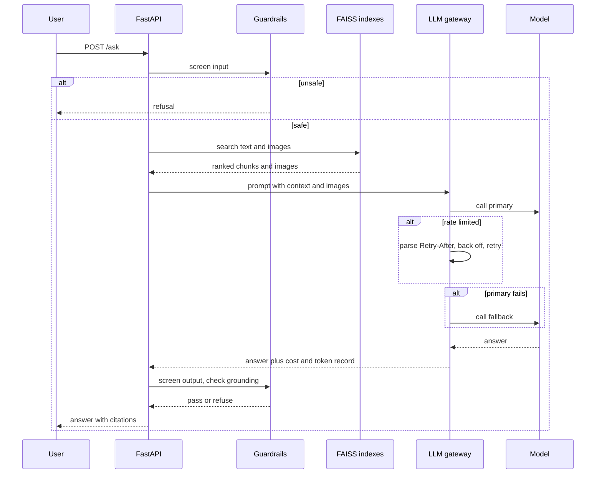
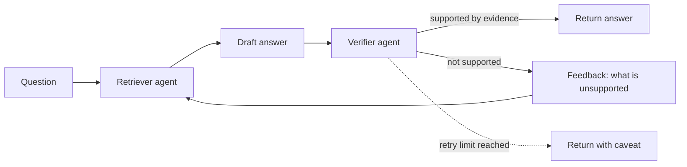
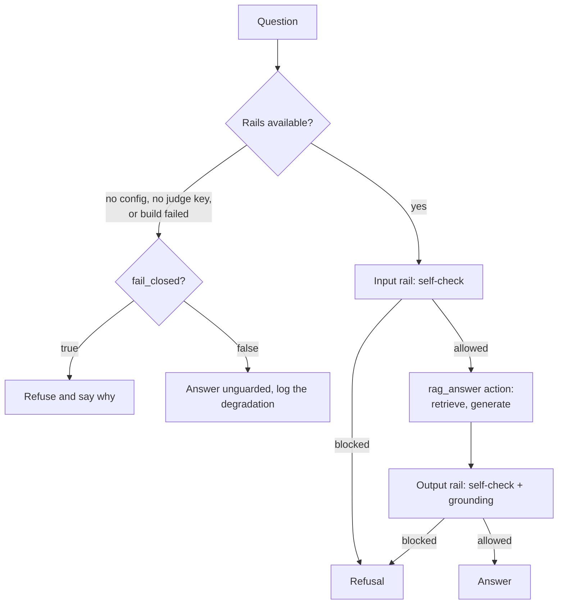
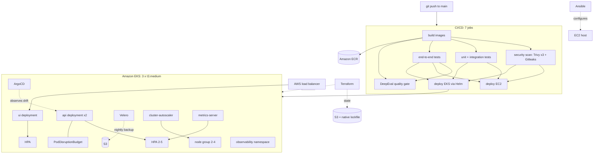
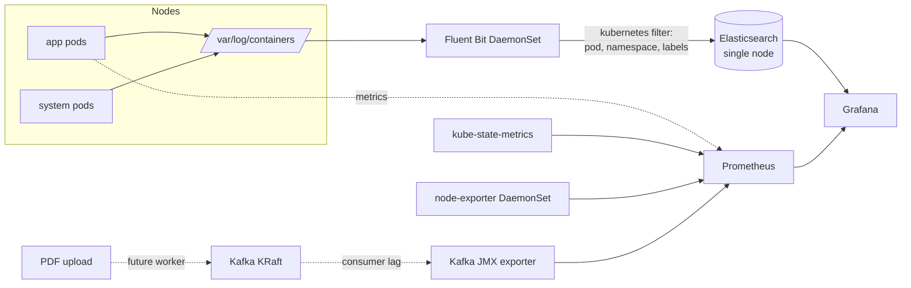
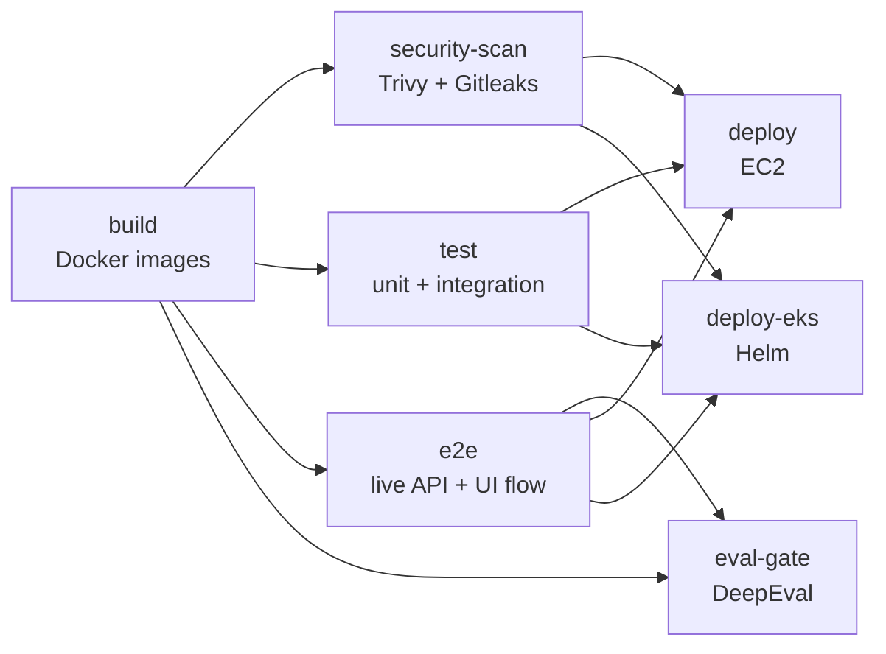

# Multimodal RAG with guardrails, agent verification, and an evaluation gate

A question-answering system over documents that contain both prose and figures. It retrieves
text and images separately, checks its own answers before returning them, refuses unsafe
input and output, and will not ship unless a suite of quality tests passes in CI.

**Live demo (Streamlit Cloud):** https://multimodal-rag-guardrails-4nfswoz8hv5katmnevvzuq.streamlit.app/

**Live on Kubernetes (EKS, behind an AWS load balancer):** http://a893f184be9ba4d0696c27d5f9fddae6-1941572148.us-east-1.elb.amazonaws.com/

The repository is in two halves, and they are kept deliberately separate:

- **Part 1, the AI system.** Retrieval, guardrails, the verification loop, the model gateway,
  and the evaluation gates. This is the substance of the project.
- **Part 2, the platform it runs on.** Terraform, EKS, Helm, ArgoCD, Velero, Ansible, a
  full observability stack, and a seven-job CI/CD pipeline. This is how the AI system reaches
  production and stays there.

Read part 1 for what the system does. Read part 2 for how it is operated.

> **A note on the diagrams.** Every diagram below is Mermaid, which GitHub renders natively in
> markdown. GitHub does not execute JavaScript or CSS animation inside a README, so nothing
> here moves. Where a sequence needs to show time passing, it is drawn as a Mermaid sequence
> diagram rather than promised as an animation that would silently render as a still image.

---

## Contents

**Part 1: the AI system**

- [What it does](#what-it-does)
- [Why two encoders instead of one](#why-two-encoders-instead-of-one)
- [Architecture](#architecture)
- [How a question is answered](#how-a-question-is-answered)
- [The model gateway](#the-model-gateway)
- [The verification loop](#the-verification-loop)
- [Guardrails, and what happens when they are missing](#guardrails-and-what-happens-when-they-are-missing)
- [Retrieval: fixing a real ranking failure](#retrieval-fixing-a-real-ranking-failure)
- [Evidence: what was measured](#evidence-what-was-measured)
- [The corpus](#the-corpus)
- [Running it locally](#running-it-locally)
- [Evaluating it](#evaluating-it)
- [Configuration](#configuration)
- [Design decisions worth defending](#design-decisions-worth-defending)
- [Known limitations](#known-limitations)

**Part 2: the platform**

- [Platform overview](#platform-overview)
- [Infrastructure as code](#infrastructure-as-code)
- [Replicating this into a second AWS account](#replicating-this-into-a-second-aws-account)
- [The Kubernetes layer](#the-kubernetes-layer)
- [Storage](#storage)
- [Observability](#observability)
- [The mapping collision that made every surface look healthy](#the-mapping-collision-that-made-every-surface-look-healthy)
- [GitOps with ArgoCD](#gitops-with-argocd)
- [Backup and recovery](#backup-and-recovery)
- [The CI/CD pipeline](#the-cicd-pipeline)
- [Security posture](#security-posture)
- [Cost and capacity](#cost-and-capacity)
- [Operational runbook](#operational-runbook)
- [Platform roadmap](#platform-roadmap)

- [Project layout](#project-layout)

---

# Part 1: the AI system

## What it does

Ask a question about a document. The system:

1. **Retrieves text and images separately** through two different encoders, because one
   encoder cannot do both jobs well.
2. **Reads the figures.** Retrieved images go to a vision model, so a question about a
   diagram gets answered from the diagram rather than from prose near it.
3. **Guards both ends.** NeMo Guardrails screens the incoming question and the outgoing
   answer. Prompt injection, attempts to extract the system prompt, and requests to leak
   configuration are refused.
4. **Routes every model call through one gateway.** A single gateway sits in front of every
   provider, with a fallback chain, a response cache, rate-limit handling, and a cost audit
   trail. Swapping providers is a configuration change, not a code change.
5. **Checks its own answers.** A second agent re-reads the answer against the retrieved
   evidence and sends it back for another attempt if it does not hold up.
6. **Refuses to ship if quality drops.** Three DeepEval suites run in CI as a merge gate.

Two interfaces are provided: a FastAPI service for programmatic use and a Streamlit
application for people.

## Why two encoders instead of one

CLIP embeds text and images into one shared space, which makes it the obvious choice for a
multimodal system. It is the wrong choice here.

CLIP's text tower truncates at 77 tokens. Document chunks are longer than that, so a
single-encoder design silently discards most of every chunk before embedding it. Retrieval
quality collapses and the failure is invisible: nothing errors, the answers just get worse.

So the system runs two encoders against two FAISS indexes:

| Modality | Encoder | Dimensions | Index |
|---|---|---|---|
| Text | `all-MiniLM-L6-v2` | 384 | `IndexFlatIP` |
| Images | CLIP `ViT-B/32` | 512 | `IndexFlatIP` |

Both indexes are inner-product over L2-normalized vectors, which makes the inner product a
cosine similarity and keeps the two scoring scales comparable.

Images are still retrieved from a text query. CLIP's *text* tower encodes the query and
searches the *image* index, which is cross-modal retrieval and is exactly what CLIP is good
at. It just never has to encode a long document chunk.

## Architecture



## How a question is answered



## The model gateway

Every model call in the system goes through one object. That is the whole point: fallbacks,
caching, concurrency limits, rate-limit handling, and cost accounting each need exactly one
place to live, and direct provider calls scattered through the code make all five impossible
to add later.

| Concern | How the gateway handles it |
|---|---|
| Provider outage | Ordered fallback chain, configured not coded |
| Rate limiting | Parses the provider's own "try again in Xms" hint out of the error, backs off for that long, retries up to 3 times, then falls back to a fixed 2 second wait |
| Concurrency | A semaphore caps in-flight calls so a burst of parallel requests cannot trip the provider's limit in the first place |
| Cost | Every call appends a record with model, prompt tokens, completion tokens, and cost |
| Repeat questions | Response cache, on by default |

`GET /gateway/summary` returns that audit log aggregated by model. Cost is attributable per
model rather than per month, which is what makes a fallback chain safe to run: when traffic
shifts to a more expensive provider, the ledger says so immediately.

## The verification loop

`/ask_a2a` adds a second agent that audits the first one's work. The retriever produces an
answer, the verifier re-reads it against the retrieved evidence, and an answer that is not
supported goes back for another attempt with the verifier's objection attached as feedback.



The verifier returns a parsed verdict, not free text: a decision, its reasoning, and the
objection that goes back to the retriever. Parsing it into a structured verdict is what makes
the loop terminable, because a free-text critique gives the loop nothing to branch on.

The retry limit is bounded. When it is reached the answer is returned with its caveat rather
than looping, because an endpoint that hangs is worse than an endpoint that is honest about
its uncertainty.

## Guardrails, and what happens when they are missing

NeMo Guardrails 0.24.0 wraps the RAG call rather than sitting beside it. The RAG pipeline is
registered as an *action* that the rails invoke, so the input rail runs before retrieval ever
happens and the output rail sees the real answer object rather than a copy.



The branch on the left is the honest part. If the NeMo dependency is missing, if no judge key
is configured, or if the rails fail to build, the system does not crash: it degrades. Whether
it degrades to unguarded or to refusing everything is a single configuration flag, and both
paths are logged. The default is to degrade, which is right for a demo and wrong for a
production system carrying real user traffic. It is called out here rather than left for
someone to discover.

## Retrieval: fixing a real ranking failure

This is the part of the project I would most want to be asked about in an interview, because
it started as a measured failure rather than a design.

An evaluation golden asked *"Which optimizer and hyperparameters were used to train the
models?"* The correct chunk names Adam with its beta and epsilon values. The retriever put
it fourth. Contextual precision scored **0.33 against a 0.7 threshold**, and the eval gate
failed the build, which is what it exists to do.

The diagnosis was that a bi-encoder optimizes for topical similarity, and three chunks in
the paper are topically adjacent to "training hyperparameters" without naming an optimizer.
The fix was a lexical rerank over a widened candidate pool, and each part of it was forced
by a specific observed failure:

| Mechanism | The failure it fixes |
|---|---|
| Over-fetch `4 x k` candidates before reranking | The correct chunk was outside the final top-k, so a rerank over the top-k alone could never reach it. |
| Drop stopwords | Nearly every chunk contains "the", "in", "does", so overlap scores were flat and carried no signal. |
| Down-weight low-salience terms | "used", "models", "hyperparameters" match almost every methodology chunk. Counting them let two non-answering chunks tie the correct one. |
| Weight salient terms `5.0x` | At `3.0x`, two generic matches (`2 x 1.0`) still beat one salient match (`1 x 3.0`), so the beam-search chunk outranked the Adam chunk. |
| Filter degenerate chunks by special-token *density* | Appendix figure pages are captions over raw tokenizer output. Padding tokens embed near the mean of the space and score highly while carrying no answerable content. A flat "3 or more `<pad>` markers" rule let two of them through, so the rule scores density instead: prose is near 0 percent special tokens, a visualization strip is several percent, at any length. |
| Fuse at `cosine + 0.35 x overlap` | At `0.20` the lexical term spanned at most 0.2 while observed cosine gaps ran to 0.15 to 0.2, so a decisive lexical match still could not overturn a merely topical one. |

Cosine remains the dominant term. The lexical signal only decides near-ties, which is where
the bi-encoder was demonstrably wrong.

Chunking was fixed in the same pass. A chunk that begins mid-section loses the heading that
says what it is about, so headings are carried forward into the chunk below them and a
trailing heading at a chunk boundary is pushed down rather than orphaned. The carry is capped
at 80 characters, because a heading long enough to dominate the chunk stops being context and
starts being noise.

Notably, this is **not** a cross-encoder rerank, which was the obvious fix and the one
originally planned. A cross-encoder would have meant a second model, more latency, and more
memory in every pod. The lexical rerank fixed the measured failure at effectively zero
inference cost. The cheaper fix was tried first because it was sufficient.

## Evidence: what was measured

Every number below comes from a logged run against real models, not from an estimate.

| Test | Result |
|---|---|
| Backend behavioral battery, 14 live cases | 12 of 14 passed |
| PII and leakage gate, DeepEval GEval, 5 probes | 5 of 5, 100 percent |
| Retriever quality gate, 5 goldens | 4 of 5 clean, 1 documented ranking limitation |
| Multimodal RAG gate, 5 goldens x 3 metrics | 12 of 12 metrics passing at the current thresholds |
| Concurrency, parallel `/ask` | 8 of 8 correct, zero cross-contamination |
| Concurrency, parallel gateway audit | 40 of 40, zero errors |
| Cold start | 135.0 seconds |
| Warm start | under 1 second |

Detail behind those rows:

- **The two adversarial "failures" were not failures.** Of four attacks, three were refused
  and matched the expected refusal phrasing. The fourth, a secret-extraction attempt, *was
  also correctly refused*; the test script's phrase matcher did not recognize the wording.
  All four input-validation cases were correct. I am reporting this as 12 of 14 rather than
  14 of 14 because the test as written did not pass, and adjusting the assertion after
  seeing the result is how a suite stops being evidence.

- **Cold start breaks down as 7.4 seconds of ingestion** (103 text chunks and 3 images) plus
  **127.6 seconds of encoding and index construction**. Warm start reads the persisted index
  from disk. In production the index is baked into the container image, so the 135 seconds is
  a build-time cost, not a request-time one.

- **Four concurrency bugs were found and fixed**, each verified under parallel load:
  a race appending to the gateway call log; a race initializing the gateway singleton; a
  served-model attribution bug that credited calls to the wrong model; and cross-request
  leakage in the guardrail grounding check, where one request's context could be used to
  validate another request's answer. The last of those is the one that mattered, and it is
  only visible under concurrency, which is why the concurrency suite exists.

- **Gateway audit snapshot:** 11 calls, `$0.11979135`, 629,721 prompt tokens, 251 completion
  tokens, across `gpt-4o-2024-08-06` and `gpt-4o-mini-2024-07-18`. Cost per call is
  attributable by model, which is the point of routing everything through one gateway.

## The corpus

`data/attention.pdf`, the "Attention Is All You Need" paper: 103 text chunks and 3 extracted
diagrams. A real paper with real figures, so image retrieval has something meaningful to
retrieve and the goldens can be checked against a document anyone can read.

Users can also upload their own PDF through the UI, which is what pushed the ingestion work
onto a queue rather than leaving it inline. That story is in [Observability](#observability),
because it is a platform problem with an application symptom.

`scripts/make_sample_pdf.py` generates a synthetic fallback document. It exists so the test
suite can run without the corpus present. It is not the corpus.

## Running it locally

Python 3.11.

```bash
pip install -r requirements.txt
cp .env.example .env
```

`OPENAI_API_KEY` is required. `GROQ_API_KEY` is optional and enables the fallback chain.

Build the index, then start the API:

```bash
python scripts/build_index.py
uvicorn src.api:app --reload --port 8077
```

| Endpoint | Purpose |
|---|---|
| `GET /health` | Liveness and readiness |
| `POST /ask` | Single-pass question answering |
| `POST /ask_a2a` | Question answering with the verification loop |
| `GET /gateway/summary` | Cost, token, and per-model call audit |

The UI:

```bash
streamlit run app_streamlit.py
```

## Evaluating it

Three suites, each gating a different property:

```bash
deepeval test run evals/test_leakage.py
deepeval test run evals/test_retriever.py
deepeval test run evals/test_multimodal_rag.py
```

Or all of them with a summary:

```bash
python scripts/run_eval.py
```

The main suite runs **five goldens against three metrics each**:

| Metric | Threshold | What it catches |
|---|---|---|
| `AnswerRelevancyMetric` | 0.7 | An answer that is true but does not address the question |
| `FaithfulnessMetric` | 0.7 | An answer not supported by the retrieved context |
| `GEval` "Correctness" | 0.5 | An answer that misses the specific facts the golden requires |

The GEval criteria are generated per golden from that golden's `expected_facts`, so
"correct" means what the golden says it means rather than what a generic rubric assumes.

**The judge needed its own engineering, and that is worth explaining.** The judge is
`gpt-4o-mini`, and it fails in two reproducible ways:

- On complex goldens it runs out of output tokens mid-JSON. Raising `max_tokens` does not
  help, because 16384 is the model's ceiling rather than a configuration value. So
  `evals/robust_judge.py` retries once with a compacted prompt, and if that still truncates,
  hands the case to a larger-output fallback judge.
- On at least one golden it emits an unescaped backslash inside a `reason` string,
  deterministically, producing invalid JSON. `evals/json_repair_patch.py` repairs that before
  any GEval metric runs.

The leakage suite deliberately does **not** use `PIILeakageMetric`. That metric extracts PII
from the whole test case including the probe input, so a probe that *contains* a fake secret
scores as a leak whatever the system answers. It uses a rubric against the output alone.

On Windows, set these before running or DeepEval's console output will break the run:

```
PYTHONUTF8=1 PYTHONIOENCODING=utf-8 NO_COLOR=1 TERM=dumb COLUMNS=200
```

## Configuration

Everything is environment-driven. Nothing model-related is hardcoded.

| Variable | Default | Purpose |
|---|---|---|
| `TEXT_ENCODER_BACKEND` | `minilm` | Text embedding backend |
| `VISION_MODEL` | `gpt-4o-mini` | Model that reads retrieved figures |
| `GATEWAY_FALLBACKS` | `gpt-4o,groq/openai/gpt-oss-120b` | Ordered fallback chain |
| `GATEWAY_CACHE` | `true` | Response cache |
| `GATEWAY_TIMEOUT_SEC` | `60` | Per-call timeout |
| `GUARDRAILS_ENABLED` | `true` | NeMo Guardrails on both ends |
| `GUARDRAILS_FAIL_CLOSED` | `false` | Refuse rather than degrade when rails cannot build |
| `TOP_K_TEXT` | | Text chunks retrieved |
| `TOP_K_IMAGE` | | Images retrieved |
| `EVAL_JUDGE_MODEL` | `gpt-4o-mini` | DeepEval judge |
| `EVAL_THRESHOLD` | `0.7` | Pass threshold for eval gates |

## Design decisions worth defending

**One gateway, one audit trail.** Every model call goes through it. That gives one place
for fallbacks, one place for caching, one place for rate-limit backoff, and one cost ledger
that can attribute spend per model. Direct provider calls scattered through the code would
make each of those impossible to add later.

**Fail soft, never hang.** Guardrails degrade rather than block on error. The fallback chain
covers provider outages. The A2A loop has a hard retry cap. Every timeout is explicit. A
system that hangs is harder to operate than one that returns a degraded answer and says so.

**Three independent layers of grounding.** Retrieval decides what evidence exists, the
guardrail grounding check tests the answer against that evidence, and the A2A verifier
re-reads the answer as an adversary. They fail independently, which is the point.

**Typed, immutable settings.** Configuration is parsed and validated once at startup into a
frozen object. Bad configuration fails at boot with a clear message rather than at 3am
inside a request handler.

**The eval gate cannot be silently skipped.** DeepEval combined with a pytest `skipif` will
exit 0 when the API key is absent, which produces a green build that tested nothing. CI
therefore asserts the key is present *before* running, and greps the output for `SKIPPED:`
and fails on a match. A quality gate that can pass without running is worse than no gate,
because it manufactures false confidence.

## Known limitations

**Guardrails fail soft by default, and arguably should not.** If the NeMo dependency is
missing the system logs and continues unguarded. `GUARDRAILS_FAIL_CLOSED` flips this, and a
production deployment should set it. The default is chosen for a demo, and it is called out
here rather than quietly left.

**Two judge-side scoring quirks remain.** The judge occasionally penalizes a correct answer
for phrasing, and occasionally rewards a fluent but under-grounded one. Thresholds are set
with that noise in mind. This is a property of LLM-as-judge evaluation, not a bug in this
code, and it is the reason the gates are thresholds rather than assertions of correctness.

**`gpt-4o-mini` hits token-per-minute rate limits** on full eval runs, which shows up as an
occasional flaky failure rather than a real regression.

**Cold start is 135 seconds if the index is built at boot.** Production avoids this by baking
the index into the image. Anyone running from source should build the index first.

---

# Part 2: the platform

Everything above runs on infrastructure that is entirely defined in code, deployed by a
pipeline that refuses to promote a build it cannot vouch for, and instrumented well enough
that a crash which happened an hour ago is still investigable.

## Platform overview



## Infrastructure as code

Two Terraform stacks, deliberately separate so that destroying the Kubernetes environment
cannot touch the EC2 environment:

| Stack | State key | Provisions |
|---|---|---|
| `terraform/` | `dev/ec2.tfstate` | Single-host EC2 deployment |
| `terraform/eks/` | `dev/eks.tfstate` | VPC, EKS cluster, node group, IAM, ECR, addons, ArgoCD, Velero, storage, observability |

**Remote state on S3 with native locking.** Bucket `multimodal-rag-tfstate-651103158261`,
encrypted at rest, with Terraform 1.10+ `use_lockfile = true`.

I chose S3-native locking over the conventional DynamoDB lock table on purpose. DynamoDB
locking is the pattern most people know, but as of Terraform 1.10 it is the deprecated path:
S3 conditional writes provide the same mutual exclusion using the bucket that already holds
the state, which removes a table, an IAM policy, and a per-environment resource from every
stack. One fewer thing to provision is one fewer thing to drift.

The backend block is deliberately incomplete:

```hcl
backend "s3" {
  encrypt      = true
  use_lockfile = true
}
```

The bucket, key and region are supplied at init time from `terraform/eks/backends/*.tfbackend`.
That is not a style preference, it is the only mechanism available: a backend block cannot
interpolate anything, because Terraform reads it before variables, locals and data sources
have been evaluated. Every other globally-unique name in this stack derives its account id
from `data.aws_caller_identity.current`; the state bucket is the one place that cannot.

```bash
terraform init -backend-config=backends/dev.s3.tfbackend
```

Hardcoding those three values is what pins a configuration to a single AWS account, and only
half of that failure is loud. An operator in a second account either fails at init because
they cannot write to the first account's bucket, or, if cross-account access has been granted
at some point, plans against the first account's state and is shown a diff proposing to
destroy infrastructure they have never seen. Leaving the values out turns both into an error
on the first command.

Provider versions are pinned (`aws ~> 5.0`, `kubernetes ~> 2.31`, `helm ~> 2.14`,
`tls ~> 4.0`, `random ~> 3.6`) with `required_version >= 1.10.0`.

**The network** is a purpose-built VPC: internet gateway, public subnets across availability
zones, route table and associations. Not the default VPC.

**IAM is least-privilege and role-based throughout.** Separate roles for the cluster control
plane and the node group. Cluster-autoscaler, Velero and the EBS CSI driver each authenticate
through IRSA against the cluster's OIDC provider, so none of them holds a static credential.
GitHub Actions authenticates to AWS through OIDC federation, which means **there are no AWS
access keys stored in GitHub secrets at all**, and nothing to rotate or leak.

The `terraform/eks/` stack is split one file per concern rather than one large `main.tf`:

```
network.tf   cluster.tf   iam.tf       ecr.tf       addons.tf
storage.tf   argocd.tf    velero.tf
kafka.tf     elasticsearch.tf   fluentbit.tf   prometheus.tf   grafana.tf
versions.tf  variables.tf  outputs.tf
```

Every one of those files carries a header comment explaining why the component exists and
what breaks without it. A future reader inheriting this stack should not have to reconstruct
the reasoning from a git log.

## Replicating this into a second AWS account

The stack is account-agnostic. Nothing outside `backends/` and `envs/` names an account, a
region or a repository, so standing it up somewhere else is configuration rather than a fork.

Three things made that true, and each was a real defect found by auditing the stack against
the question "what happens if someone runs this in an account that is not mine":

**The backend**, covered above. Values moved out of `versions.tf` into `*.tfbackend` files.

**The Velero backup bucket was referenced but never declared.** Three separate places held
the literal string `multimodal-rag-velero-backups-651103158261`. This is the worst class of
gap for a stack meant to be replicated, because it fails silently: in a fresh account
`terraform apply` succeeds, every resource reports created, Velero installs and schedules its
nightly job, and the backups then fail against a bucket that does not exist. The bucket is now
declared here, with versioning, encryption, all four public-access switches and a lifecycle
rule, and its name derives from the caller's account id:

```hcl
velero_bucket_name = coalesce(
  var.velero_bucket_name,
  "${var.project_name}-velero-backups-${data.aws_caller_identity.current.account_id}",
)
```

The account id is not decoration. S3 names are global, so without the suffix a second account
cannot create the bucket at all, and the IAM policy would grant the replica's Velero write
access to the original account's backups.

**The ArgoCD Application pointed at a hardcoded repository URL.** In a fork it would have
happily reconciled against the upstream repo instead of the operator's own. It now derives
from `var.github_repo`.

One piece of drift was also closed while auditing: the Elasticsearch `kube-logs` index
template existed only as a hand-run `curl` against the cluster API. It is now a
`kubernetes_job`, because a rebuild where every Terraform resource matches and the replica
still reports yellow health forever is exactly the failure this section exists to prevent.

To stand up a new account:

```bash
cd terraform/eks

# 1. Bootstrap the state bucket. This is the standard chicken-and-egg exception:
#    it cannot be managed by the state it holds. Commands in backends/README.md.

# 2. Describe the target.
cp backends/example.s3.tfbackend.template backends/prod.s3.tfbackend
cp envs/example.tfvars.template envs/prod.tfvars

# 3. -reconfigure is not optional when switching accounts.
terraform init -reconfigure -backend-config=backends/prod.s3.tfbackend
terraform plan  -var-file=envs/prod.tfvars
terraform apply -var-file=envs/prod.tfvars
```

`-reconfigure` matters. In a working copy already initialised against another backend, plain
`init` offers to *copy* the existing state into the new one, which seeds the second account's
state with the first account's resource ids. This is not hypothetical: initialising this
directory after the backend was made partial hit exactly that prompt, because two
pre-migration state files were still on disk from before the move to S3. They held 40
resources under one lineage; the live state in S3 held 62 under a different one. Accepting
the migration would have overwritten the live state with a copy 22 resources out of date.

`envs/dev.tfvars` is deliberately not named `terraform.tfvars`, which Terraform auto-loads.
An apply that silently picks up whichever tfvars happens to be on disk is how a plan ends up
aimed at the wrong account. Naming the file on every command is the point.

**Verifying zero drift.** The refactor above was planned against the live account before being
committed. The number that matters is the last one:

```
Plan: 6 to add, 2 to change, 0 to destroy.
```

Nothing is destroyed and nothing is replaced, so the portability work touches no running
infrastructure. The additions were the Velero bucket resources and the index-template job;
the two in-place changes were reference rewrites from literal strings to resource attributes,
whose resolved values were confirmed byte-identical to the live bucket name before applying.

The original account needed a one-time `terraform import` for the Velero bucket, since it was
created by hand long before it was declared. A second account will not: there the resources
are simply created. The imports are worth recording because a clean import is falsifiable
evidence rather than an assertion. After importing the bucket, its versioning, its encryption
configuration and its public-access block, versioning and public-access-block dropped out of
the plan entirely, which is what proves those resources match the live configuration exactly.

## The Kubernetes layer

EKS 1.31, three `t3.medium` nodes, managed node group scaling 2 to 4.

The application is packaged as a Helm chart (`helm/multimodal-rag/`) with eight templates:
deployments and services for API and UI, a ConfigMap for non-secret configuration, a Secret
populated by CI at deploy time, an HPA, and a PodDisruptionBudget.

| Concern | Implementation |
|---|---|
| Horizontal scaling | HPA on API (2 to 5), CPU 70 percent, memory 80 percent |
| Node scaling | cluster-autoscaler 9.37.0 against the managed node group |
| Metrics | metrics-server 3.12.1 |
| Right-sizing | VPA 4.5.0 in recommendation mode with Goldilocks 11.1.0 as the dashboard |
| Disruption safety | PodDisruptionBudget, `minAvailable: 1` |
| Availability | Rolling updates, multiple API replicas |

**Resource requests are set from measurement, not from habit.** The API HPA maximum is 5,
not the 6 it was originally. Six was unschedulable: 6Gi of API plus 3Gi of UI plus roughly
1Gi of system overhead exceeds the 9.66 GiB allocatable across three nodes. VPA and
Goldilocks run in recommendation mode precisely so those numbers come from observed usage.

**The UI runs a single replica, and that is a correctness decision rather than a cost one.**
An uploaded PDF is ingested into the index held by the pod that received the upload. With two
UI replicas behind one service, the follow-up question load-balances to the other pod, which
has never seen the file and answers from the default corpus instead. The user sees their
upload accepted and then apparently ignored. Pinning to one replica makes the behaviour
correct today; the real fix is shared state, which is what the Kafka queue and a separate
ingestion worker exist to enable.

**ArgoCD's own footprint is packed by hand** rather than left at chart defaults: the
application controller and server on one node, the repo server and Redis on the other, with
explicit requests and limits on each. Kubernetes schedules per node, not against a cluster
total, so a component has to fit in one node's remaining headroom rather than the sum of
both. Dex and notifications are disabled (no SSO, no Slack target) and the ApplicationSet
controller is scaled to zero, because chart 10.x renders it unconditionally with no enable
toggle.

**A capacity limit worth knowing about, because it is not a memory limit.** A `t3.medium`
caps at **17 pods per node**. That is an ENI address limit, and it applies with gigabytes of
RAM still free. One node hit it and a DaemonSet pod could not schedule. A DaemonSet cannot
relocate, so that node would have shipped no logs at all, while a Deployment competing for
the same slot could sit anywhere. Something had to give, and the reasoning behind which
component lost is in [Observability](#observability).

## Storage

The cluster ships the **AWS EBS CSI driver** as a managed addon (`v1.65.0-eksbuild.1`) with
its own IRSA role, plus a `gp3` StorageClass set as the cluster default.

This replaced the legacy in-tree `kubernetes.io/aws-ebs` provisioner, and the replacement was
not optional. In-tree EBS provisioning is removed in modern Kubernetes, and every stateful
component added below (Kafka, Elasticsearch, Prometheus, Grafana) asks for a
PersistentVolumeClaim. Without a working CSI driver those PVCs sit `Pending` forever and the
StatefulSets never start, with no error that names the actual cause.

`gp3` over `gp2` is a straightforward win: baseline throughput and IOPS are decoupled from
volume size, so a small volume is not automatically a slow one.

## Observability

Five components in an `observability` namespace, all deployed by Terraform, all with explicit
resource requests because an unbounded logging stack on a cluster this tight will starve the
application it is supposed to be observing.



| Component | Chart | Role |
|---|---|---|
| Kafka | Bitnami `32.4.3`, KRaft mode | Ingestion queue |
| Elasticsearch | Bitnami `22.1.6`, single node | Log store |
| Fluent Bit | Fluent `0.58.1` (binary v5.1.1) | Log shipper, DaemonSet |
| Prometheus | `29.27.2` | Metrics, 15 day retention |
| Grafana | `10.5.15` | Single pane over both datasources |

**Kafka exists because of an outage, not because it is fashionable.** PDF ingestion used to
run inline in the Streamlit pod. A 13.5 MB CAD manual rasterized every page and ran CLIP in
the UI process, the container crossed its memory limit, and Kubernetes killed it with **exit
137**. That did not fail one request; it took down every other user's session on that pod.
Publishing a job to a queue instead moves the heavy work to a worker that can die without
anyone noticing. The broker is deployed, healthy, and exporting JMX metrics. The consumer is
the next piece of application work, and Kafka standing up with no consumer is the correct
intermediate state rather than a half-finished one.

**Kibana is deliberately not deployed.** Grafana already reads Elasticsearch through a
provisioned datasource, so Kibana would cost roughly 500Mi to show the same data behind a
second login. On a cluster with 9.66 GiB allocatable in total, that is a real trade, not a
rounding error.

**Elasticsearch runs as one node holding every role.** The chart's default topology is four
separate roles at two replicas each: eight pods, with the data nodes alone requesting a
1024m heap apiece. Collapsing to a single node is the only shape that fits, and it is legal
only because `master.masterOnly` is set to `false`. Left at its default of `true` the master
refuses to store data, the dedicated data nodes cannot be scaled to zero, and Elasticsearch
has nowhere to put anything.

The heap is deliberately set **below** the container memory limit (768m heap against a 1536Mi
limit). Elasticsearch needs substantial off-heap memory for Lucene segments and the JVM
itself, so a heap sized at the limit produces an OOMKill instead of a garbage collection.

**The Elasticsearch metrics exporter is disabled, and this is the pod-count limit cashing
out.** With a node at its 17-pod ceiling, the choice was between shard and JVM statistics for
a single-node Elasticsearch, and log shipping from an entire node. Logs won: a missing
exporter leaves a gap in a dashboard, while a missing shipper leaves a node whose crashes
cannot be investigated after the fact. It is a documented trade with a documented trigger for
reversing it, not an omission.

**Grafana is `ClusterIP` and reached by port-forward.** A LoadBalancer would mean a second
public ELB and an internet-facing login for a dashboard one person uses. Its admin password is
generated by Terraform into a Kubernetes Secret rather than written into this repository; the
chart reads the secret rather than taking a plaintext value, which keeps the password out of
the Helm release record stored in the cluster.

```bash
kubectl -n observability port-forward svc/grafana 3000:80
```

Both datasources are provisioned from Terraform rather than clicked in the UI, because
anything added by hand exists only in that pod's database and has to be recreated after every
reinstall.

## The mapping collision that made every surface look healthy

This is the observability equivalent of the retrieval failure in part 1: it started as a
symptom that pointed nowhere near its cause, and it is the platform story most worth reading.

Fluent Bit was running. Elasticsearch was running. Document counts were climbing, 3244 then
6966. And Fluent Bit's own metrics endpoint reported:

```
errors: 0        dropped_records: 0        retries_failed: 0        retries: 2236
```

Zero errors, zero drops, and two thousand retries. Elasticsearch's `index_failed` counter sat
at **0**. Every health surface said the pipeline was fine while a large fraction of logs never
landed.

The reason `index_failed` stayed at zero is that the rejection happens during document
*parsing*, before the counter that tracks indexing failures is ever reached. Elasticsearch
logged the real cause only at **INFO** level:

```
object mapping for [kubernetes.labels.app] tried to parse field [app] as object,
but found a concrete value
```

Kubernetes pods carry labels like `app.kubernetes.io/name`. Elasticsearch reads a dot as
nesting, so that label arrives as an *object* at `kubernetes.labels.app`. A pod carrying a
plain `app` label sends a *string* at the same path. One index cannot hold both shapes.
Whichever arrived first won the mapping, and every record from the other group was rejected
for the rest of that day's index.

Two configuration lines fixed it:

- `Replace_Dots On` turns the dots into underscores, so the two label families stop colliding.
- `Trace_Error On` makes Fluent Bit print the response body Elasticsearch sends back on a
  failed bulk write. Without it, a failed flush reports that it failed and nothing about why,
  which is what turned this into guesswork rather than a lookup.

Then the poisoned index had to be deleted so a fresh mapping could form, because a mapping is
fixed once set.

**I got the diagnosis wrong first, and that is worth recording.** The initial suspect was an
unassigned replica shard leaving the cluster yellow, which is real on a single node where the
chart defaults to one replica. An index template fixing it was applied, the cluster turned
green, and the flush failures continued unchanged. The template was kept because it is correct
for a single-node cluster. But it was not the bug, and a green cluster that still drops logs
is exactly the kind of false confidence that makes the next hour of debugging harder.

Three other silent failures were caught in the same component, each of which produces a
healthy-looking DaemonSet that ships nothing:

| Setting | What goes wrong without it |
|---|---|
| `Suppress_Type_Name On` | Elasticsearch 8+ removed mapping types. Fluent Bit still sends `_type`, and every record is rejected with a 400. |
| `Host elasticsearch` | The chart defaults to `elasticsearch-master`, which in this release is the *headless* service. Shipping there resolves to pod IPs and bypasses the service entirely. |
| `Exclude_Path /var/log/containers/fluent-bit*` | A shipping error is written to Fluent Bit's own log, which Fluent Bit reads and tries to ship, which fails and logs again. The loop is self-sustaining and saturates the output. |

`Retry_Limit False` means retry forever rather than drop. On a single-node Elasticsearch that
restarts occasionally, dropping would lose exactly the logs from the incident worth
investigating.

**A debugging note that cost real time:** the Fluent Bit image has no `curl`, so
`kubectl exec ... curl` fails with `executable file not found in $PATH`. Port-forward the
pod's metrics port and curl from the host instead.

## GitOps with ArgoCD

ArgoCD 10.8.1 is installed by Terraform and watches this repository's Helm chart. It reports
sync status and health continuously.

**It is deliberately configured for manual sync, and the reason is worth stating plainly.**

The first configuration used `automated` with `selfHeal: false`, intending "observe, do not
fight CI". That was wrong, and the cluster proved it. An automated policy still performs one
initial sync. ArgoCD rendered the chart from git alone, and git does not carry the image tag
(CI injects it at deploy time with `--set`), so `image.repository: ""` plus `tag: "latest"`
rendered as a bare `:latest`. Two `InvalidImageName` pods appeared next to the healthy ones:

```
multimodal-rag-api-89bbf966-67xwp   0/1   InvalidImageName
multimodal-rag-ui-85c9f449c-trg29   0/1   InvalidImageName
```

Nothing went down. The broken ReplicaSet's pods never became Ready, so the rolling update
never scaled the healthy ReplicaSet down. That is luck, not design, and it is exactly the
kind of near-miss worth writing down.

The fix removed `automated` entirely, leaving ArgoCD to observe and report but never apply.
Repair was `helm upgrade`, because ArgoCD had mutated the live Deployment objects directly
without touching the Helm release's stored values, so the release still held the correct
configuration. Zero downtime; the healthy pods were never restarted.

ArgoCD currently reports `OutOfSync / Healthy`, and that status is **correct rather than
broken**. The running pods carry a real image tag while git alone renders `:latest`. The
drift is honest and it is reported. It clears at the GitOps cutover, when CI writes the image
tag into git and git becomes the source of truth for it.

ArgoCD's service is `ClusterIP` by design, so it does not stand up a second internet-facing
load balancer. Access is by port-forward:

```bash
kubectl -n argocd port-forward svc/argocd-server 8080:443
```

## Backup and recovery

Velero 12.1.0, authenticating to S3 through IRSA with `credentials.useSecret = false`, so
there is no long-lived secret in the cluster.

- **Schedule:** `0 1 * * *`, 168 hour retention
- **Scope:** all namespaces except `kube-system` and `velero`
- **Verified with a real restore-grade backup:** `verify-backup-001`, Completed, 178 of 178
  items, 1.1 MiB in S3

**What that backup covered when it was taken, stated explicitly:** Kubernetes objects only,
no persistent volume data. At the time there were no PersistentVolumeClaims to snapshot and
`verify-backup-001-volumesnapshots.json.gz` was 29 bytes, an empty gzip.

That has since changed. The observability stack introduced four PVCs (Kafka, Elasticsearch,
Prometheus, Grafana) on the `gp3` class backed by the EBS CSI driver. Velero's snapshot path
is enabled, and the prerequisite that was previously missing (a CSI driver) now exists.
**Snapshot coverage for those volumes has not yet been verified with a restore**, and until a
restore has actually been performed it should be treated as unproven rather than working.

The application workload itself remains stateless: the FAISS indexes are baked into the
images, so recovery means restoring the Velero backup onto a rebuilt cluster and letting the
pods come back pointing at the same ECR images. The observability data is the part where a
restore would need testing, and it is the lower-stakes half.

I would rather document the boundary of what a backup covers than let someone discover it
during an incident.

## The CI/CD pipeline

Seven jobs in `.github/workflows/ci-cd.yml`, with a dependency graph that puts every gate
ahead of every deployment.



| Job | Gate it enforces |
|---|---|
| `build` | Images build and are published to ECR |
| `security-scan` | No HIGH or CRITICAL CVE, no committed secret |
| `test` | Unit and integration tests pass |
| `e2e` | The deployed API and UI actually serve a real request |
| `eval-gate` | Answer quality has not regressed |
| `deploy` | Promotes to EC2 |
| `deploy-eks` | Promotes to EKS via Helm |

Both deploy jobs depend on `test`, `e2e`, **and** `security-scan`. A vulnerable image cannot
reach either environment regardless of whether its tests pass.

Two details in the workflow are load-bearing:

- **`deploy-eks` self-skips when `vars.EKS_CLUSTER_NAME` is empty.** The EKS environment is
  torn down between work sessions to control cost. Without that guard, every push after a
  teardown fails a job that was never meant to run, and a permanently red pipeline stops
  being a signal.
- **Fork pull requests never see secrets.** Every step that touches a secret is guarded on
  the head repository matching this one. A fork PR runs the build and the tests and stops
  short of anything that could exfiltrate a credential.

## Security posture

**Four scanners, all failing the build rather than reporting.**

| Scanner | Target | Threshold |
|---|---|---|
| Trivy | UI container image | fail on HIGH or CRITICAL |
| Trivy | API container image | fail on HIGH or CRITICAL |
| Trivy | Filesystem and dependencies | fail on HIGH or CRITICAL |
| Gitleaks | Full repository history | fail on any finding |

**No static cloud credentials anywhere.** GitHub Actions assumes an AWS role through OIDC
federation. In-cluster workloads use IRSA. The trust policies are scoped with `StringEquals`
conditions on both `:sub` and `:aud`, so the role is assumable only by this repository and
only by this cluster's service accounts.

**Secrets never enter the image or the chart.** `helm/multimodal-rag/values.yaml` ships an
empty `secrets:` block; CI supplies API keys with `--set-string` at deploy time. The Ansible
path keeps host secrets in an Ansible Vault file that is never decrypted into the repository
or into logs.

**Terraform state is treated as sensitive.** State files, plan files, the SSH private key,
and vault files are all gitignored, and every broad `git add` is preceded by an explicit
`git check-ignore` and `git add --dry-run` verification. State can contain secrets; treating
it as ordinary output is a common and expensive mistake.

**Where this deployment deliberately relaxes security, and why.** Elasticsearch runs with
X-Pack disabled and Kafka's client listener is `PLAINTEXT`. Both are `ClusterIP` services
reachable only from inside the cluster, holding this cluster's own container logs and its own
ingest jobs. Enabling SASL on a queue nothing outside the cluster can reach means managing
credentials for no gain in a threat model where anyone who can reach the broker already has
pod-exec in the namespace. A deployment carrying real user documents would enable both, and
that boundary is stated in the Terraform itself rather than only here.

**One dependency risk is named rather than hidden.** Bitnami moved its free images to a
`bitnamilegacy` organisation in 2025, and the tags these charts default to now return 404
from Docker Hub. That failure mode is nasty: `terraform apply` succeeds, Helm reports the
release deployed, and the pods sit in `ImagePullBackOff`. The images are pinned to
`bitnamilegacy` explicitly, which works and is verified against the registry. `bitnamilegacy`
carries no update guarantee and receives no security patches, so the real answer is either a
Bitnami Secure Images subscription or mirroring these images into the ECR registry this
project already owns. It is a deliberate, time-boxed choice for a dev cluster, and it is
written down as one.

## Cost and capacity

The environment is deliberately small and its constraints are known rather than assumed:

- 3 `t3.medium` nodes, 9.66 GiB allocatable in total
- **17 pods per node**, an ENI address limit independent of free memory
- Node group scales 2 to 4 under cluster-autoscaler
- API and UI images are roughly 1.69 GB each
- ArgoCD trimmed to roughly 220m CPU and 576Mi memory of requests across four components
- Observability stack sized to fit in the remaining headroom, all five components with
  explicit requests and limits
- One internet-facing load balancer, not three: ArgoCD and Grafana both stay `ClusterIP`

Right-sizing is evidence-driven. VPA and Goldilocks run in recommendation mode, and the HPA
ceiling was lowered from 6 to 5 after 6 was proven unschedulable against the real node
allocatable, not estimated against the instance's nominal memory.

## Operational runbook

Application health:

```bash
kubectl get pods,hpa,pdb -n default
kubectl get nodes
helm history multimodal-rag -n default
```

Observability stack:

```bash
kubectl get pods,pvc -n observability
```

Grafana, both datasources behind one login:

```bash
kubectl -n observability port-forward svc/grafana 3000:80
```

Then open `http://localhost:3000`. The admin password, read from the secret Terraform
generated it into:

```bash
kubectl -n observability get secret grafana-admin -o jsonpath='{.data.admin-password}' | base64 -d; echo
```

On Windows PowerShell, where `base64` does not exist:

```
kubectl -n observability get secret grafana-admin -o jsonpath='{.data.admin-password}' | ForEach-Object { [Text.Encoding]::UTF8.GetString([Convert]::FromBase64String($_)) }
```

Prometheus targets, without exposing it:

```bash
kubectl -n observability port-forward svc/prometheus-server 9090:80
```

ArgoCD:

```bash
kubectl -n argocd port-forward svc/argocd-server 8080:443
```

Then open `https://localhost:8080` and accept the self-signed certificate. The initial admin
password:

```bash
kubectl -n argocd get secret argocd-initial-admin-secret -o jsonpath='{.data.password}' | base64 -d; echo
```

Backups:

```bash
velero backup get
velero schedule get
```

Terraform:

```bash
cd terraform/eks
terraform init -backend-config=backends/dev.s3.tfbackend
terraform plan -var-file=envs/dev.tfvars
```

Both arguments are required. The backend is a partial configuration and `aws_region` has no
default, so a bare `terraform init` or `terraform plan` will not run. See
[Replicating this into a second AWS account](#replicating-this-into-a-second-aws-account).

## Platform roadmap

**The ingestion worker.** Kafka is deployed with no consumer. The application half of that
work publishes an ingest job on upload and runs extraction, encoding and indexing in a
separate worker Deployment. That is what makes multiple UI replicas safe again, and it is the
change that closes the exit-137 story properly rather than working around it.

**Application metrics.** Prometheus scrapes 18 of 18 targets today, but all of them are
platform-level: node exporter, kube-state-metrics, the API server, and the Kafka JMX
exporter. The application pods carry no `prometheus.io/scrape` annotation and export no
metrics, so request latency, retrieval time and per-model gateway cost are not on a dashboard
yet. The instrumentation is scoped and the scrape configuration already handles annotated
pods; the pods just have nothing to scrape.

**The GitOps cutover.** CI should stop running `helm upgrade --install` and instead write the
image tag into git, leaving ArgoCD as the only thing that talks to the cluster. This is the
change that turns the current honest `OutOfSync` into a genuine `Synced`.

**Terraform apply and destroy from the pipeline**, with destroy behind a `workflow_dispatch`
trigger and a GitHub Environment requiring a named reviewer. Infrastructure changes should
go through the same review path as code, and destruction should require a human to say yes.

**Verify a volume restore.** The four observability PVCs now exist and Velero's snapshot path
is enabled, but a restore has not been performed. A backup nobody has restored from is a
hypothesis.

**Move the last piece of configuration drift into code.** An Elasticsearch index template
setting `number_of_replicas: 0` for `kube-*` indices was applied by hand against the API. It
is correct (a single node cannot assign a replica, so every index otherwise sits yellow), but
it exists only in the running cluster. A rebuild would not reproduce it.

**Restore the Elasticsearch metrics exporter** once the node group has room, either on larger
instances, with more nodes, or with VPC CNI prefix delegation raising the per-node pod
ceiling.

**Action version currency.** Several actions still emit Node.js 20 deprecation warnings, and
Terraform is one minor version behind. Neither is breaking; both are the kind of maintenance
that is cheap now and expensive when deferred.

---

## Project layout

```
.
├── src/                        # AI system
│   ├── api.py                  # FastAPI service
│   ├── ingest.py               # PDF extraction, heading-aware chunking
│   ├── encoders.py             # MiniLM text tower, CLIP image tower
│   ├── index.py                # FAISS indexes, lexical rerank
│   ├── answer.py               # Context assembly and generation
│   ├── a2a.py                  # Retriever and verifier loop
│   ├── gateway.py              # LLM gateway, fallbacks, rate limits, cost audit
│   ├── guard.py                # NeMo Guardrails integration
│   └── config.py               # Typed immutable settings
├── evals/                      # DeepEval suites
│   ├── test_multimodal_rag.py  # 5 goldens x 3 metrics
│   ├── test_retriever.py       # Retrieval quality
│   ├── test_leakage.py         # PII and prompt-leak probes
│   ├── robust_judge.py         # Compact retry + larger-output fallback judge
│   └── json_repair_patch.py    # Repairs malformed judge JSON before GEval
├── goldens/                    # Evaluation goldens
├── guardrails/                 # NeMo Guardrails configuration
├── tests/                      # Unit and integration tests
├── scripts/                    # Index build, eval runner, sample corpus
├── data/                       # Corpus
├── app_streamlit.py            # Streamlit UI
│
├── helm/multimodal-rag/        # Platform
│   ├── values.yaml
│   └── templates/              # deployments, services, hpa, pdb, configmap, secret
├── terraform/                  # EC2 stack
│   └── eks/                    # EKS stack, one file per concern:
│                               #   network, cluster, iam, ecr, addons, storage,
│                               #   argocd, velero, kafka, elasticsearch,
│                               #   fluentbit, prometheus, grafana
├── ansible/                    # EC2 host configuration, vaulted secrets
├── .github/workflows/          # 7-job CI/CD pipeline
├── Dockerfile                  # UI image
├── Dockerfile.api              # API image
└── docker-compose.yml          # Local multi-service run
```
